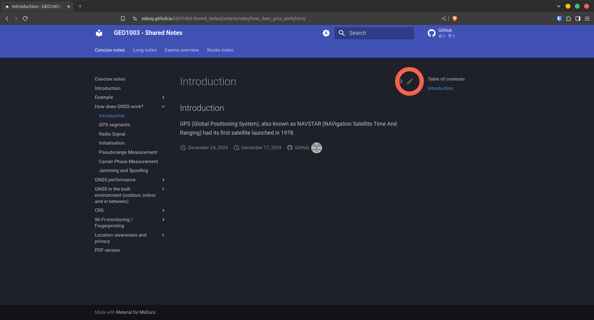

# Contribution guide

- [Contribution guide](#contribution-guide)
  - [How to contribute?](#how-to-contribute)
  - [Contributing on Github](#contributing-on-github)
  - [Short guide](#short-guide)
    - [Overall structure](#overall-structure)
    - [Find a note in the repository](#find-a-note-in-the-repository)
    - [Add a new note](#add-a-new-note)
    - [Images](#images)
    - [Markdown syntax](#markdown-syntax)
  - [Longer guide](#longer-guide)
    - [Overall structure (longer version)](#overall-structure-longer-version)
    - [Repository structure](#repository-structure)
    - [Markdown structure](#markdown-structure)
  - [PDF and website generation](#pdf-and-website-generation)
    - [Automatic build](#automatic-build)
    - [Local build](#local-build)

To contribute to these shared notes, you can take notes about any part of the reader that has not been tackled yet, or proofread notes made by others.
This guide can help you to understand how to contribute to the notes.
Anyway, if you have any question, you can ask it to me by message or create an issue on Github.

This guide contains:

- The section [How to contribute?](#how-to-contribute) which gives a general idea of the expected pipeline for a contribution.
- The section [Contributing on Github](#contributing-on-github) to have step-by-step instructions if you are not familiar with Github.
- The section [Short guide](#short-guide) to have more details about potential pitfalls and how to avoid them.
- The section [Longer guide](#longer-guide) with more details about the structure of the notes and how to add content to them.
- The section [PDF and website generation](#pdf-and-website-generation) to know how the notes are built and how to build them locally.

## How to contribute?

Here is the expected pipeline for a contribution:

1. Fork the repository
2. Make your changes:
   1. Take notes about a part of the reader that has not been tackled yet
   2. Put these notes in a new file in a folder in [`docs/content/books`](../docs/content/books) (*not mandatory*)
   3. Copy the interesting parts of the notes at the right place in the long notes:
      1. You might have to split the content to various places
      2. If nothing in the current outline is fitting, you can add a new note or a new section in a note
      3. If you add a new note:
         1. Long and short notes are all in [`docs/content/notes`](../docs/content/notes)
         2. Long notes should have the same name as their concise counterpart with `-long` at the end
         3. Don't forget to add the path to the concise note to the outline in [`docs/notes.txt`](../docs/notes.txt)
   4. Add to the concise notes a concise version of everything you added in the long notes
3. Commit your changes
4. Push your changes
5. Create a pull request (you can look at [this article](https://opensource.com/article/19/7/create-pull-request-github) for more information)
6. Wait for the review and be ready to apply changes if needed

## Contributing on Github

If you want step-by-step instructions about contributing on Github, you can read [this article](https://lifeincoding.com/how-to-contribute-to-open-source-on-github/) or [this one](https://medium.com/@niceperson2110/making-your-first-github-contribution-a-beginners-guide-to-open-source-6d4a297358aa).

## Short guide

If you don't know exactly how Github works, you should look at one of the guides from the previous section [Contributing on Github](#contributing-on-github).

### Overall structure

The notes are split in 3 parts:

1. The **concise** notes (to print for the exam)
2. The **long** notes (more explanations than the concise notes)
3. The **books** notes (notes organized per book from the reader)

### Find a note in the repository

If you want to modify a specific part of the notes and need to find its location in the repository, you can either:

- Browse the [`docs/content`](../docs/content) folder on Github
- Find it on the website and can click on the pencil at the top right of the content:
  

### Add a new note

To add a new note (i.e. a new note topic or a new chapter of a book), you need to:

- Create a new file and put it in the right folder:
  - In [`docs/content/notes`](../docs/content/notes) if it is a new note topic
  - In [`docs/content/books`](../docs/content/books) if it is a new chapter of a book
- Add it to the outline in of the following files in the [`docs`](../docs) folder:
  - In [`notes.txt`](../docs/notes.txt) if it is a new note topic
  - In [`books.txt`](../docs/books.txt) if it is a new chapter of a book

Unless you add the path to the note in one of the outlines, the note will not be included in the final notes (neither web version nor PDF version).

### Images

**ALL** the images used in the notes should be in the [`docs/images`](../docs/images) folder, due to a limitation of the PDF generation process.

### Markdown syntax

The notes are written in Markdown.
To learn about Markdown syntax, you can read [this article](https://guides.github.com/features/mastering-markdown/) or [this syntax article](https://www.markdownguide.org/basic-syntax/).
The only Markdown rule you should ignore is that the first header of a file should not always be a level 1 header (`#`), because the header levels must be coherent with the structure of the notes, between the different files.
If you don't know what header level to use, you can look at the other files in the same folder or in sibling folders.

## Longer guide

This part explains more in detail the structure of the notes and how to add content to them.

### Overall structure (longer version)

Overall, the notes are split in 3 parts:

1. The **concise** notes
2. The **long** notes
3. The **books** notes

The final and most crucial notes are the **concise** notes.
These are the ones that will be printed at the end for the exam.
They follow a logical structure by topic, to be easier to use during the exam.
Their different chapters were defined by looking at the exams from previous years.
The content in the concise notes needs to be concise to be printable and usable for the exam.

Then, the **long** notes are the mirror of the concise notes.
They have to follow the exact same structure except they contain more thorough explanations that allow anyone to understand the concise notes.
The content of these long notes doesn't need to be concise, it needs to be self-explanatory.

Finally, the **book** notes are more of an intermediary part.
They contain one chapter per book and in each chapter, they follow exactly the structure of the book.
The idea behind this part is to allow anyone curious about a book to quickly learn what it is about.
It can also be very useful to anyone looking for more details about a specific topic, to know which sections of which books deal with it.
If you take notes sequentially when reading a book, adding notes to the book notes shouldn't ask you increased efforts.
The content of these book notes should be like the content of the long notes.

### Repository structure

The repo is structured as follows:

```bash
GEO1003-Shared-Notes/
├── .cache/             # Cache folder for the website version
├── .github/            # Github Actions and contribution guidelines
├── docs/               # Main folder
│   ├── bash/           # Scripts to export the notes as PDF
│   ├── content/        # Content of the notes
│   │   ├── books/      # Notes per book from the reader
│   │   └── notes/      # Notes merged in coherent chapters
│   ├── images/         # Images
│   ├── javascripts/    # LaTeX rendering for the website version
│   ├── pdf/            # Notes exported as PDF
│   ├── index.md        # Main page of the notes for the website version
│   ├── metadata.yaml   # Metadata of the notes
│   ├── books.txt       # Table of contents of the books notes
│   └── notes.txt       # Table of contents of the notes
├── .gitignore          # Git ignore file
├── .markdownlint.json  # Markdown linting configuration
├── mkdocs.yml          # MkDocs configuration file for the website version
├── README.md           # Main README file
└── requirements.txt    # Python requirements
```

If you only want to add or modify the content of the notes, you only care about a subset of what you can find in the folder [`docs`](../docs).
There, you can find:

- The folder [`content`](../docs/content) which contains all the content of the notes
- The folder [`images`](../docs/images) where **ALL** the images used in the content should be
- The file [`notes.txt`](../docs/notes.txt) containing the outline of the concise and long notes (only the files that are in this file will be part of the concise and long notes)
- The file [`books.txt`](../docs/books.txt) containing the outline of the book notes (only the files that are in this file will be part of the book notes)

The folder [`content`](../docs/content) is split between [`notes`](../docs/content/notes) for the concise and long notes (which have the same structure) and [`books`](../docs/content/books) for the book notes.
The two parts have their own structure.

In [`notes`](../docs/content/notes), each folder is a different topic and is organized in several Markdown files, each dealing with one sub-topic.
Every file has a concise and a long version.
The long version must be named by adding "-long" before the extension.
So if the concise file is called `good_clear_name.md`, the long file must be called `good_clear_name-long.md`.

In [`books`](../docs/content/books), each folder is a different book and is organized in several Markdown files, each dealing with one chapter of the book.

In both cases, every folder should contain a `title.md` file (and a `title-long.md` in the case of  [`notes`](../docs/content/notes)).
These files define the displayed name of the "folder".

### Markdown structure

The syntax for Markdown files follows the standard syntax.
There is only one exception regarding the headers.
These headers are used when rendering to PDF with Pandoc, and therefore they must be coherent between the different files.
The consequences are:

- The first header of a file should be at the correct level, for example a level 3 header for a note in [`content/notes/crs`](../docs/content/notes/crs).
- All the folders in [`content/notes`](../docs/content/notes) and in [`content/books`](../docs/content/books) should have a file called `title.md` (and `title-long.md` in the case of [`content/notes`](../docs/content/notes)) with the title of the folder, to ensure a correct hierarchy.

## PDF and website generation

The PDF versions are built using Pandoc and the website version is built using MkDocs.

### Automatic build

Whenever changes are pushed to the main branch, the GitHub Actions will automatically:

1. Build the PDF versions of the notes
2. Build and publish the new version of the notes on the GitHub Pages

This process takes a few minutes, so if your changes are not directly visible on the website, this is normal.

### Local build

You can also build the notes locally. However, the versions used online will be the ones built by the GitHub Actions.

To build the notes locally, you can follow these steps:

1. Clone the repo with:

    ```bash
    git clone git@github.com:ZokszY/GEO1003-Shared_Notes.git
    ```

    To clone your own fork, you can replace `ZokszY` by your GitHub username.

2. Create a Python virtual environment and install the requirements:

    ```bash
    python3 -m venv .venv
    source .venv/bin/activate # Different on Windows, look at the link below
    pip install -r requirements.txt
    ```

    The commands are slightly different on Windows, you can look at the [official Python documentation](https://docs.python.org/3/library/venv.html#how-venvs-work) for more information.
    The virtual environment is only needed for the website generation.

3. Export the notes as PDF (these commands require bash):

    ```bash
    cd docs
    bash bash/run_all.sh
    ```

    The PDF versions will be in the [`docs/pdf`](../docs/pdf) folder.
    This command must be run from the [`docs`](../docs) folder.

4. Run the website version locally:

    ```bash
    cd ..
    mkdocs serve --open
    ```

    This command will open a new tab in your browser with the website version of the notes.
    You can ignore errors about `git-committers`.
    This command must be run from the root of the repository.
