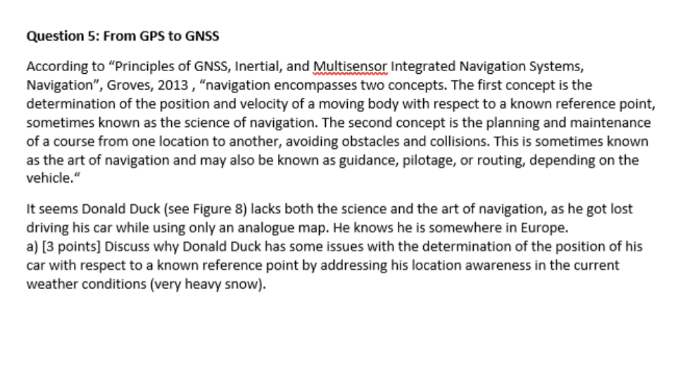

## Lecture 1: Introduction

### Main Focus

- Global Navigation Satellite Systems (GNSS)
- Indoor positioning technologies
- Location-aware applications in built environment

### Key Components

- Global, local, and linear reference systems
- Coordinate systems and map projections
- Positioning methods and techniques
- Social and technical factors in location-based services

### Study Goals

#### 1. Understanding core concepts

- Location awareness
- Location sensitivity
- Context awareness

#### 2. Understanding reference systems

- Global systems
- Local systems (e.g., Dutch)
- Linear systems

#### 3. Knowledge of

- Ethical factors
- Legislative factors
- Privacy issues

#### 4. Application skills

- Coordinate systems
- Positioning methods
- Indoor localization

#### 5. Evaluation capabilities

- Technical performance (availability, accuracy, integrity, continuity)
- Ethical considerations
- Legislative compliance

### Location-Based Services (LBS)

#### 1. Key Characteristics

- High performance (sub-second queries)
- Scalability
- Reliability (99.9999% uptime)
- Real-time information delivery
- Mobile accessibility
- Security features

#### 2. Use Cases

- Proximity services
- Geofencing
- Routing
- Tracking

#### 3. Components

- Mobile communication
- GPS receivers
- Smartphones and other devices

### Positioning Accuracy Requirements

- Global: Stock market/News
- Regional (<80km): Weather
- Local (<20km): Traffic information
- 1-20km: Alarm messages
- 100m-1km: Points of Interest
- 10-100m: Outdoor navigation
- 1-10m: Object identification
- 0.01-1m: Land surveying

### Answer of the question

> *Donald Duck faces multiple positioning challenges while navigating with an analog map in snowy weather conditions: First, reduced visibility due to snow makes it difficult to identify traditional visual reference points such as road signs and buildings, preventing him from correlating map locations with the actual environment. Second, snow coverage obscures road boundaries and landmarks, further complicating the determination of relative position. Finally, relying solely on an analog map lacks real-time positioning capabilities, unlike modern GNSS systems that provide accurate location information and navigation parameters. These combined factors make it challenging for him to accurately determine his position relative to known reference points.*
