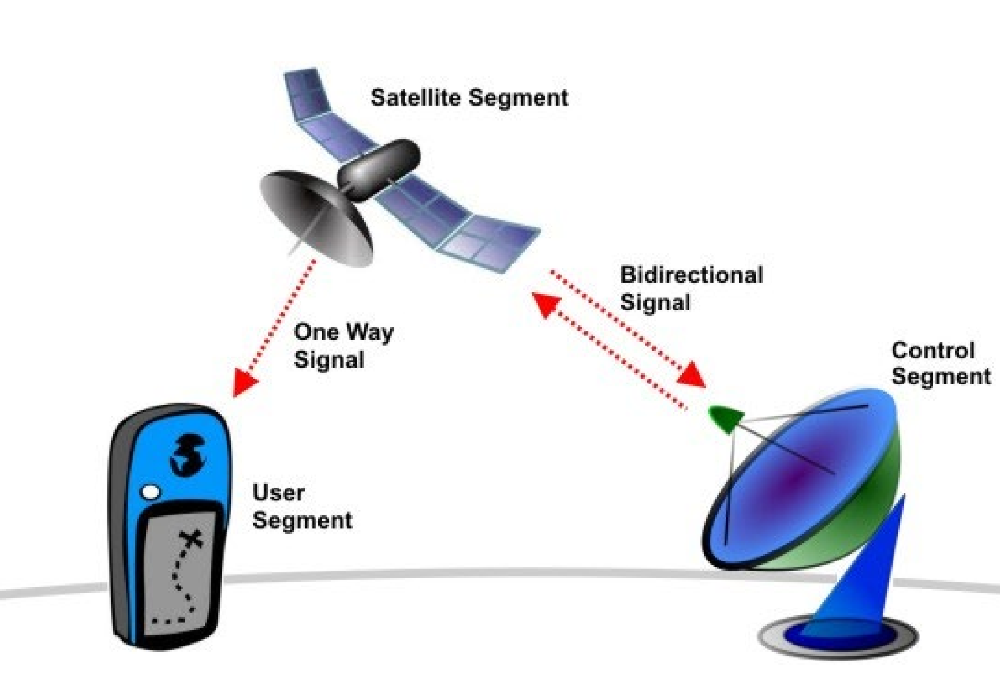
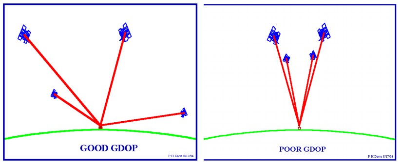

## Lecture 2 + 3： GNSS Code Code-Observation Positioning Performance for the built environment Part 1 + 2

### Structure

1. Basic Principles
2. GNSS System Overview
3. Performance Parameters
4. Position Determination and DOP and Time to First Fix
5. Advanced GNSS Technology
6. Indoor and Urban Applications

### Basic Principles

*A correct youtube video -- How does GNSS work? (From previous notes)*

- NAVSTAR constellation used with GLONASS  
- Need 4 satellites \- trilateration  
- This one includes relativity principles  
- Timing is the most important thing to consider: **we measure time**, not distance!
- Satellites broadcast timestamp and position (receiver calculates distance based on speed of light c \=29,979,458 m/s)  
- 5-10 m accuracy on average  
- Ionosphere can cause errors / least error happens with satellite straight above

### GNSS System Overview

#### Different Constellation System around the world

- GPS 
- Glonass
- Galileo
- Compass (Beidou)

#### Segments of GNSS

{ width="350" }

**How it works?**  
Generally, The satellites send one-way signals to receiver. By measuring how long these signals take to arrive from at least four satellites, receiver can calculate its exact position on Earth. This is possible because each satellite has an atomic clock and sends a unique identification code (PRN) with its signal

**Three main segments**:

1. Satellites (Space Segment):
  - Each has a unique ID signal (PRN)
  - Uses atomic clocks for precise timing
  - Sends navigation data: time, orbit info, and position corrections
2. Ground Control:
  - Fixed stations that monitor satellites
  - Check and correct satellite positions and timing
  - Send updates to satellites
3. User Device (like your phone):
  - Needs clear view of sky
  - Starts empty but learns satellite positions
  - Uses cheaper quartz clock
  - Calculates position by comparing signal times from multiple satellites
  - Your device figures out where you are by measuring how long signals take to arrive from different satellites. The more satellites it can see, the more accurate your position!

### GNSS Performance Parameters

1. Accuracy: how well it aligns with the reference(true) value
2. Precision: how closely the repeated measurements are to each other
3. Availability: The probability that enough satellites are visible and working properly to calculate your position when you need it
4. Continuity: The probability that the system will continue to work without interruption during the entire length of your intended operation
5. Integrity: Able to provide timely warning when it fails to meet its stated accuracy
  - How to monitor integrity?
    - ephemeris data: it contains precise satellite orbit info, and is onlt valid for max 4 hrs, so needs update regularly
    - workflow:
       1. control station reveives signals from satellite
       2. control station sends corrected data to satellite
       3. satellite broadcasts updated data to receiver 

#### Common error range

- ionosphere 4.0m
- ephemeris 2.0m
- satellite clock 2.0m
- multipath 1.0m
- troposhpere 0.5m
- uere(user equivalent range error) 5.0m

### Position Determination and DOP and Time to First Fix

#### How to Determine Position?

1. How many unknown parameters?
   - 3 coordinates (XYZ) (Cartesian coords) WGS84 or ($\lamda$, $\phi$, h) WGS84 (latitude, longtitude, elevation) (Geographic coords)
   - clock bias: the time difference between the satellite precise atomic clock and receiver's quartz clock
2. **Thus 4 satellites are needed! But more is beter!**

#### DOP(Dilution of Precision)

The quality of satellite geometry and its effect on position accuracy:

- Good DOP: satellites are spread across the sky
- Bad DOP: satellites are clustered

**DOP Types**

1. GDOP: overall position + time
2. PDOP: 3D position quality
3. HDOP: 2D position quality
4. VDOP: Height accuracy

{ width="450" }

#### Time to first fix

How long your GPS device takes to calculate its first position

1. Cold Start: Slowest
  - Device knows nothing
  - Must search for all satellites from scratch
  - Takes longest time
2. Warm Start: Medium
  - Has some recent data
  - Must get new ephemeris data
  - Each satellite broadcasts every 30s
  - Data valid for 4 hours
3. Hot Start: Fastest
  - Has all recent valid data
  - Can quickly connect to satellites
  - Most common in daily use

QuickFIX/Assisted GPS is a technology to speed up this process, typically used in smartphones.

### Advanced GNSS Technology

#### Assisted GPS

1. Mobile Station Based A-GPS:
  - Device gets 3 things from network:
    * Ephemeris data
    * Reference position
    * Reference time
  - Gets pseudo-ranges from satellites
  - Device calculates its own position
2. Mobile Station Assisted A-GPS:
  - Device gets same data from network
  - Also gets pseudo-ranges from satellites
  - BUT device sends measurements to server
  - Server calculates position
  - Server may or may not send position back

Main difference:

- First type: Your device does the calculations
- Second type: Server does the calculations

This is used in smartphones to:

- Speed up position finding
- Save battery power
- Work better in poor signal conditions

#### Differential GPS

- Two stations used
- Cancels out common errors between stations
- Transmits corrections from reference to user for whom the line of sight is blocked 
- Can be provided by commercial service or public (more recent)

#### Augmented GNSS

- Uses GNSS info from external sources  
- Increases accuracy of position

#### Wide Area DGPS

WADGPS:

- WAAS = Wide Area Augmentation System  
- EGNOS = European Geostationary Nabigation Overlay Service  
- Antenna should be facing south, low elevation, to get best signal from satellite

#### Carrier Phase GPS

- Used for high precision surveying, L1 & L2 carrier signals, wavelength 19/24 cm. millimeter accuracy
- phase measurements of carrier waves, resolve integer ambiguity(number of complete wavelengths) problems, relative positioning(positions between pts), single/double difference techniques
- more accurate, but hard to measure and process
- **can be used for moving and static measurements**
  - static GPS: two or more gps receivers that don't move, both measure at the same time, takes a few mins, cm accuracy
  - kinematic GPS: 2 or more receivers, 1 stay still, 1 rovers, seconds results, cm accuracy, moving surveys

#### SSR: Precise Point Positioning(PPP)

Uses a small network of reference stations worldwide (about 40). These stations track satellites and calculate error corrections. Can work even if nearest station is 1000+ km away
1. regualr PPP: 2 frequencies, remove ionosphere delay, more accurate
2. low cost PPP: 1 frequency, model to predict ionosphere effects, less accurate but cheaper.
Main advantageL don't need a nearby base station, get accuracy over the world, simpler that other high accuracy GPS methods

#### GISCAD-OV

- Galileo Improved Services for Cadastral Augmentation Development On-field Validation  
- Develop design and validate High Accuracy Service (HAS)  
- Can take some time to get to the high accuracy (not relevant for quick / real-time applications)

### Indoor and Urban Applications

#### Urban Canyon

- High rise buildings and narrow streets influence line of sight to satellites  
- DOP: if satellites are only straight above, higher error

#### Indoor GPS performance

- weakened signals(never designed for indoors)
- unclear where exactly people are located
- multipath problems: signals bouncing off buildings and objects, causes position errors

#### GPS combines with Galileo

- Worldwide coverage  
- Requires direct line of sight of min 4 satellites  
- Increases number of available satellites at best possible angle
- 
**Conclusions from a research article**:

1.Coverage of GPS alone
  - Not sufficient within street lanes
  - Sufficient on street crossings – where to decide which direction
  - Appropriate for lots of outdoor LBS applications 
2. Combination of GPS and Galileo
  - 27 Galileo + 24 GPS + EGNOS
  - Availability almost 100% during day
  - Accuracy 2 – 5 meters
  - Appropriate for almost all outdoor LBS applications
