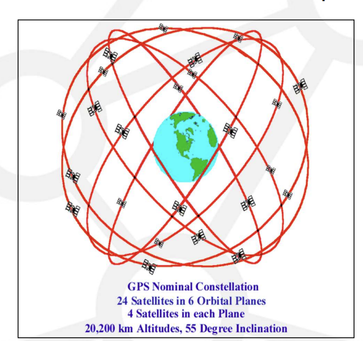
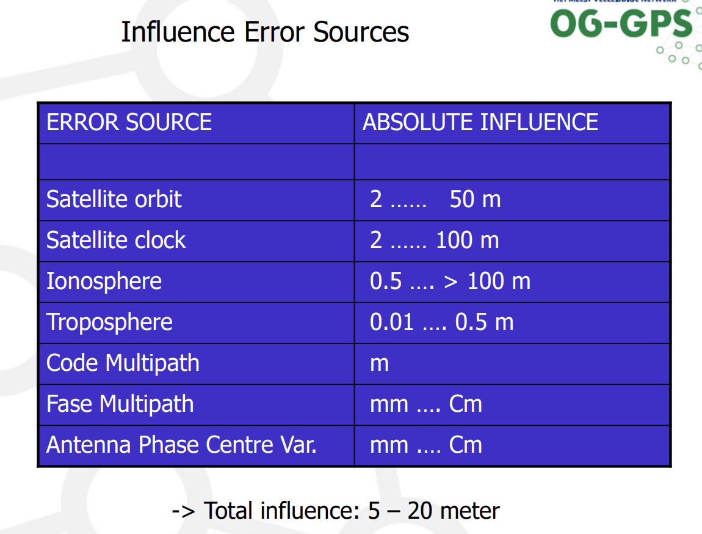
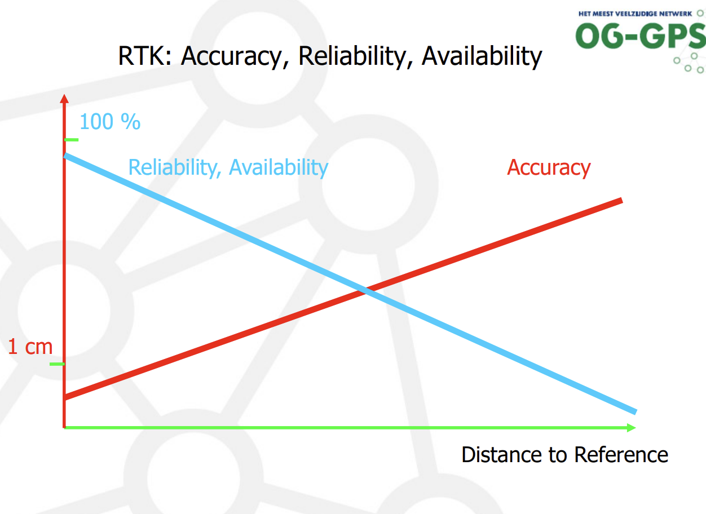
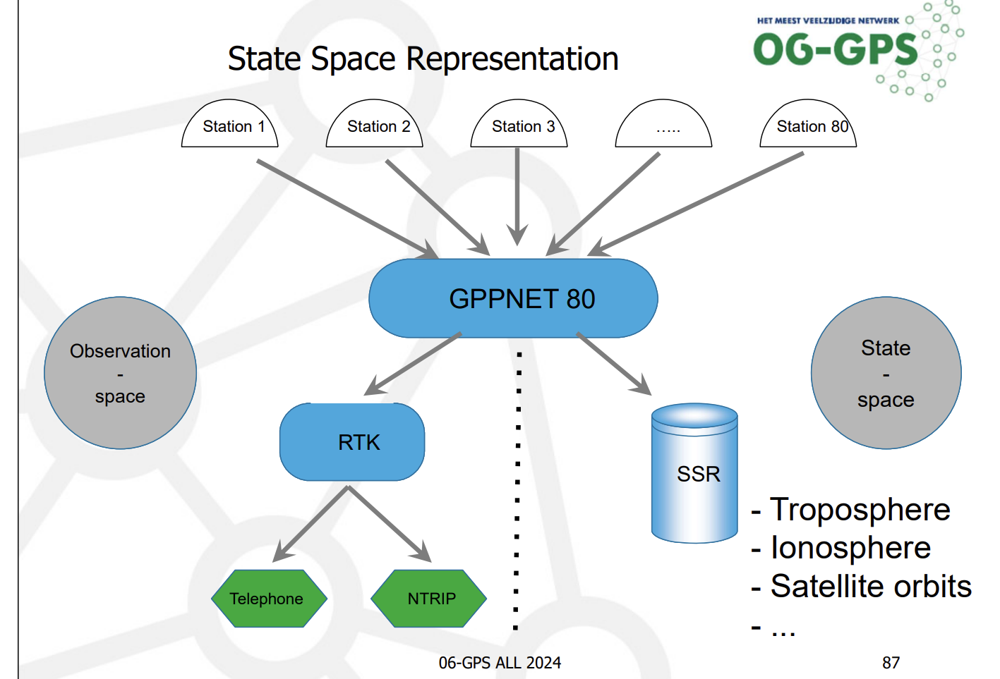
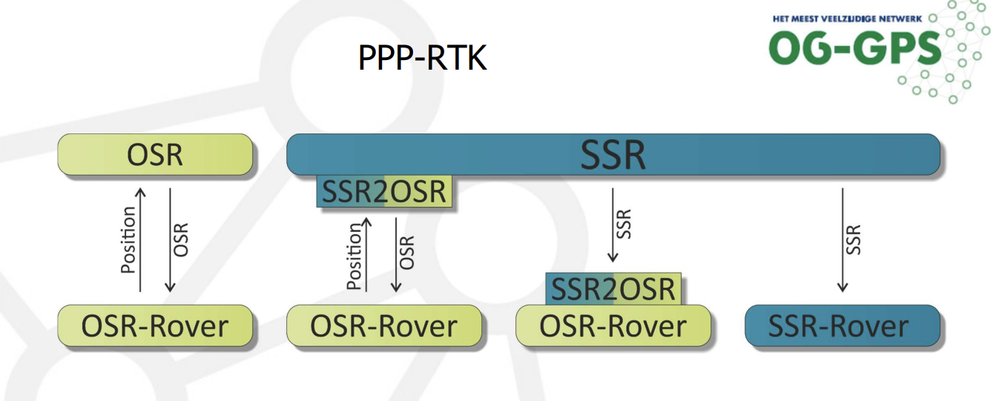
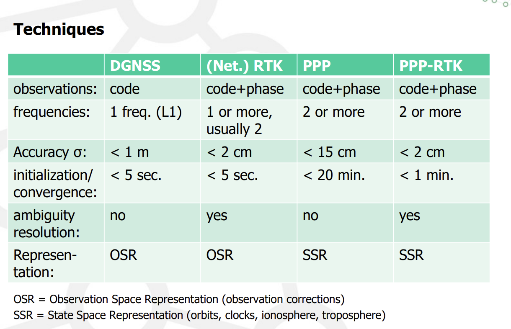
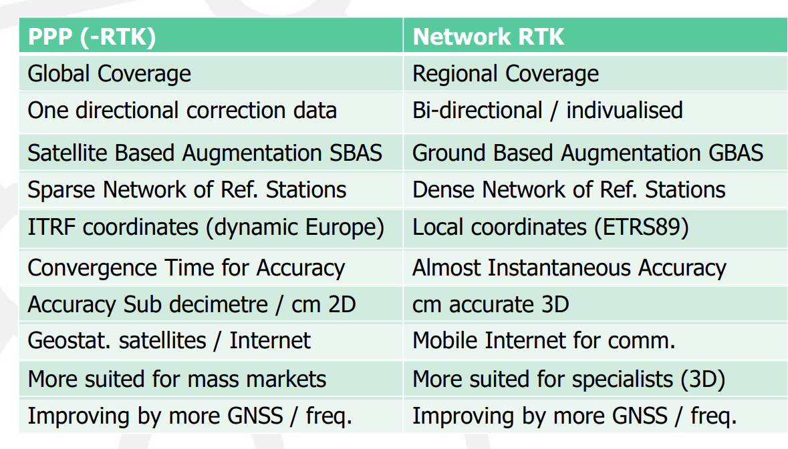
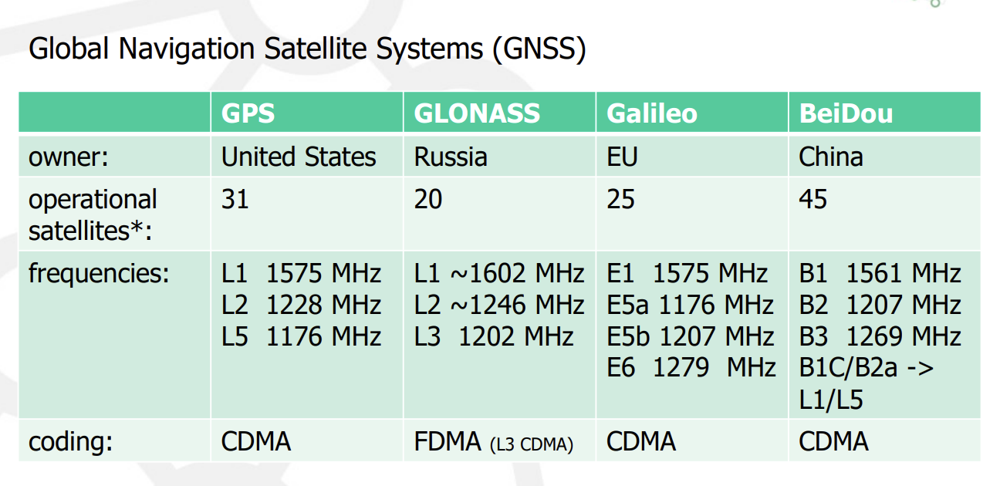

## Lecture 4: Network RTK, GNSS Augmentation, GNSS Modernization (GUEST LECTURE)

### Structure
- Company Info (not covered)
- Principle GNSS
- Principles GNSS Augmentation(RTK, Network RTK, PPP, PPP-RTK)
- Improvements by new GNSS(Galileo, Beidou)

### General Conclusions
- GNSS positioning is influenced by absolute and distance dependent errors
- DGNSS and local RTK systems can only handle absolute errors– > limited RTK (and DGNSS) range
- Network RTK models all error sources
– > Therefor Network RTK (and DGNSS) offers:
- homogeneous accuracy, reliability and availability

### 1.Principal GNSS
- signal travel time = tst - trec
- distance = travel time * light speed(3 * 10^8 m/s)

#### Coordiantes
1. RTK GNSS provides positions in:
- European system (ETRS89)
- Dutch national grid (RD)
2. RD system features:
- Used for all objects in Netherlands
- Uses absolute X-Y coordinates
- Height measured relative to NAP (Amsterdam Ordnance Datum)
3. Technical procedures:
- RDNAPTRANS2008™ implemented in GNSS receivers/software
- Updated to RDNAPTRANS2018™ in October 2022
4. ETRS89 and WGS84
- ETRS89 - derivation of WGS84 that is pinned to the European continent (so that it doesn’t change over time)
- Need to use the same coordinate system for all applications
- Receiver integrates transformation from ETRS to X,Y

#### Error sources
- Absolute positioning: one stand-alone GNSS receiver - suitable for navigation but not surveying (1 ~5m)
- Satellite orbit error
- Satellite clock error
- Ionosphere (100 -1000 km above earth - electrons are activated by solar activity and affect speed of GNSS signal) 
- Troposphere: temp, humidity and pressure affect signal transmission
- Multipath: local, sat signal is reflected by the surface before reaching receiver (therefore distance measurement is affected)
- Receiver clock error

#### Differential GNSS Positioning
1. Error Source Determination
   - calculates errors at known pos
   - generate corrections
2. Correction Transmition
   - from base station to mobile rover
3. Apply Corrections
   - rover uses corrections
   - reduces error effects
4. Position Determination using:
   - DGNSS: code observations
   - RTK: carrier phase observations(more accurate real time kinematic)
5. Distance dependency of DGNSS and RTK
   - the greater the distance is, the larger the error (the distance between reference and unknown place)

6. RTK Limitations
if too far from reference, the error is no longer acceptable

7. Network GNSS
   - Beter Coverage
     - multiple reference stations from a network, beter coverage than single based station, thus reliable error handling
   - Distance Benefits
     - Overcome distance limitations of single based RTK, interpolate error between reference stations so rover accuracy can be determined

#### VRS Representation
*This combines network reliability with single-base simplicity, ideal for static/slow-moving applications.*
1. System Components
- Network of reference stations
- Computing center
- Virtual station created 1-2m from user

2. Process Flow
- Reference stations send data to computing center
- User connects to system
- Center interpolates network corrections
- Corrections delivered as if from nearby virtual station

3. Benefits
- RTK-level accuracy
- Compatible with standard rovers
- Minimal representation error
- Efficient data transmission

4. Limitations
- Not suitable for fast-moving objects over large distances (e.g., trains)
- Virtual reference can't maintain stability for long-distance movement

#### State Space and Observation Space

Explanations: Observation Space：RTK Services: raw measurements from satellites, code ranges, carrier phases, etc. **direct observations**
State Space: SSR: Proccessed error components, troposhpheric delays, satellite orbits, etc. **error sources and physical models**

#### PPP-RTK

1. Direct OSR
- Base measures satellite distance
- Direct line-of-sight transmission to rover
2. Two-Way OSR
- Rover sends position (GGA)
- Base returns OSR corrections 
- Two potential error paths
- Requires mobile network

3. SSR to OSR Conversion
- Rover receives state space data
- Converts to observation space internally

4. Pure SSR
- Rover gets satellite data directly
- Self-improves measurements
- Independent position determination

### 2. Augmentation
#### Precise Point Positioning (PPP)
- GNSS satellite orbits and clock corrections broadcasted by geostationary satellite or internet; does not require bi-directional communication
#### Satellite-based augmentation systems (SBAS)
-  EGNOS (which provides correction for GPS)
#### Ground-based augmentation systems (GBAS)
-  sent via mobile internet (4G), or radio if own base is used.
#### Augmentation Comparisons

#### PPP and Network_RTK

### 3. Modern GNSS
#### Developments
- SBAS(EGNOS) developed
- GLONASS 24 satellites
- increase usage of rtk network
- mobile internet (5G/3GPP)
- GPS L2C: beter quality for civil user
- 3rd frequency GPS(L5)
- Full constellation of Galileo and Beidou

#### Improvements
- Availability of satellites, especially near obstacles:  
  - More satellites means lower DOP values, more visible in sky plots  
  - Skyplot affected by urban canyons, may not see minimum of 5 satellites for RTK, but combining systems could help  
- Speed of initialisation  (more=beter)
- Accuracy  
- Robustness against solar activities
**Conclusion**
1. more and larger constellations is better
   - Better Availability
   - Better Accuracy
   - Faster and more reliable fix of phase ambiguities over
longer distances
- Resistance against atmospheric disturbances
2. Network RTK