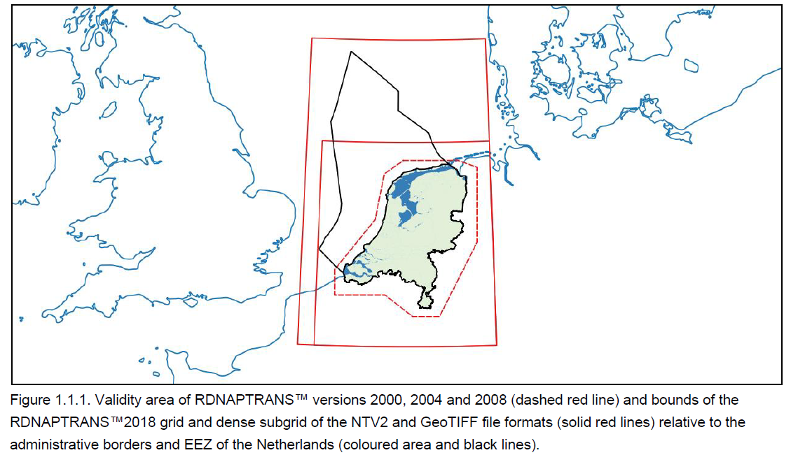
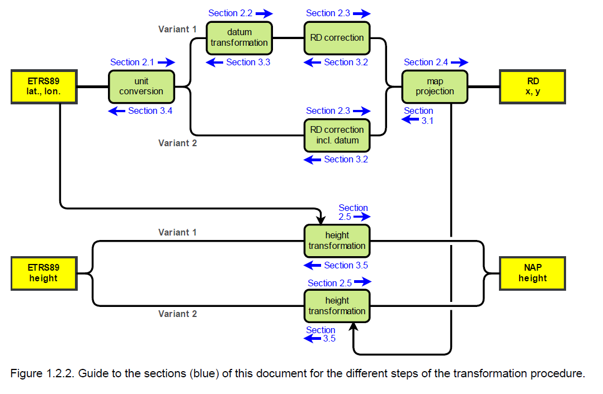

## Introduction
### Coordinate Systems
Official 3D coordinate system of the Netherlands and Europe: European Terrestrial Reference System 1989 (ETRS89).
ETRS89 is linked to the International Terrestrial Reference System (ITRS) by a time-dependant coordinate transformation. 
National coordinate systems in Europe are linked to ETRS89.

Coordinates in the Dutch Stelsel van de Rijksdriehoeksmeting (RD) are the most-frequently used 2D coordinates on land and internal waters.
RD coordinates are defined by the official transformation from ETRS89 coordinates.
Maintaining reference points for ETRS89 and the transformation to RD coordinates are legal responsibilities of Kadaster.

Heights relative to Normaal Amsterdams Peil (NAP) are the official and the most-frequently used heights on land and internal waters.  The NAP is a legal responsibility of Rijkswaterstaat

Ellipsoidal heights in ETRS89 can be transformed with the quasi-geoid model to NAP with a precision higher than ETRS89 coordinates obtained with most GNSS measurements.

Storage and exchange of geo-information at sea:
1. International Hydrographic Organisation (IHO): World Geodetic System 1984 (WGS 84), 
2. EU: ETRS89.

The difference is presently (2019) approximately 0.75 m and increasing by 0.024 m per year.

Since ellipsoidal heights in ETRS89 are only geometrical and have no physical meaning, other height references are used too.
{ width="600" }

While ETRS89 coordinates cannot be visualised on a paper map or a map on a computer screen without a map projection. RD coordinates are very suitable as map projection for visualisation of geo-information in ETRS89 coordinates for the entire European part of the Netherlands, including the Dutch Exclusive Economic Zone (EEZ) of the North Sea, and its surroundings.

### Coordinate transformation

The official coordinate transformation between European ETRS89 coordinates and Dutch coordinates in RD and NAP is called RDNAPTRANS™
As a trademark, permission is required to be used. Permission is granted for correctly implemented aplications. **In some software, the transformation method is implemented correctly, but the software needs to be configured or the right options need to be selected to support RDNAPTRANS™.**

Introduction of RDNAPTRANS™: 2000
Several versions since then. The version of 2018 include the following uptades: datum transformation based on the updated ETRS89 coordinates of realisation ETRF2000 (epoch 2017.50), a new and more accurate quasi-geoid grid model. 

The recommended ETRS89 realisation is ETRF2000 at epoch 2010.50 (AGRS2010). When using RDNAPTRANS™2018 it is important to use this realisation and epoch, especially for the height. For applications demanding high accuracy, it is recommended to obtain the NAP height of the point of interest by levelling to nearby NAP benchmarks.

{ width="600" }
There are two variants for the implementation of the horizontal component of RDNAPTRANS™2018 and two variants for the vertical component (Figure 1.2.2). 

Implementation variant 1 applies the datum transformation as a separate step using a 3D similarity transformation. 
The advantage of implementation variant 1 is that it has no strict bounds for the area where horizontal coordinates can be transformed correctly. The disadvantage is that many software packages do not support implementation variant 1 for the horizontal component. 

Implementation variant 2 includes the datum transformation in the correction grid and uses a different quasi-geoid grid for the height transformation. Implementation variant 2 for the horizontal component is supported by more software but can only be used within the bounds of the correction grid (Figure 1.1.1). The difference in the resulting coordinates between the two variants is well below 0.0010 m within the bounds of the RDNAPTRANS™2018 grids. 

Although transformation at sea and even outside the grid bounds is possible, the scale factor of the map projection increases rapidly and also **the precision of transformation back and forth deteriorates**. There are bounds to the recommended use of RD and NAP at sea and outside the Netherlands.

PROJ library can be used for large datasets.
