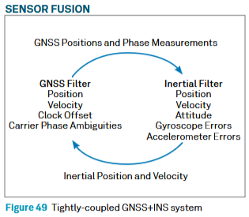

## 6 - Sensor fusion

> pages 61-66 of Hexagon intro to GNSS

This chapter describes the fusion of different sensors together with GNSS to provide more accurate positioning.

### GNSS + INS systems

GNSS provides the position only when there is a good connection and clear line of sight, which is not always the case.
A IMU doesn't need a connection, which makes it a good candidate to complement GNSS.

An IMU is made up of six sensors arrayed on three orthogonal axes.
On each of the three axes, an accelerometer and a gyroscope are coupled.
The accelerometers measure linear acceleration, and the gyroscopes measure rotational rates.
The INS translates this angular solution into a local attitude (roll, pitch and azimuth) solution, which it can provide in addition to the position and velocity.

Naturally,  INS systems have their own downsides:
- the position drifts relatively quickly because of the buildup of inaccuracies over time
- the position - more like location -  measurements happen in a local reference frame from a starting point which has to be provided to the INS.

Thus, when GNSS and INS are combined, the two techniques enhance each other to provide a powerful navigation solution.
When the GNSS conditions are good (line of sight to several satellites), the GNSS receiver provides accurate position and time to the navigation system.
When the GNSS conditions become poor, the INS provides the position and navigation until the GNSS conditions improve.

GNSS is not the only useful input to aid inertial navigation. For different environments, different sensors can also be added to aid the solution.
- Odometer: a Distance Measurement Instrument (DMI) provides another independent measurement of displacement and velocity
- Vision-aided navigation: imagery is used to provide position information in one of two ways.
  - Known surveyed camera targets can be used to generate an absolute position
  - Everyday objects can be used as control point