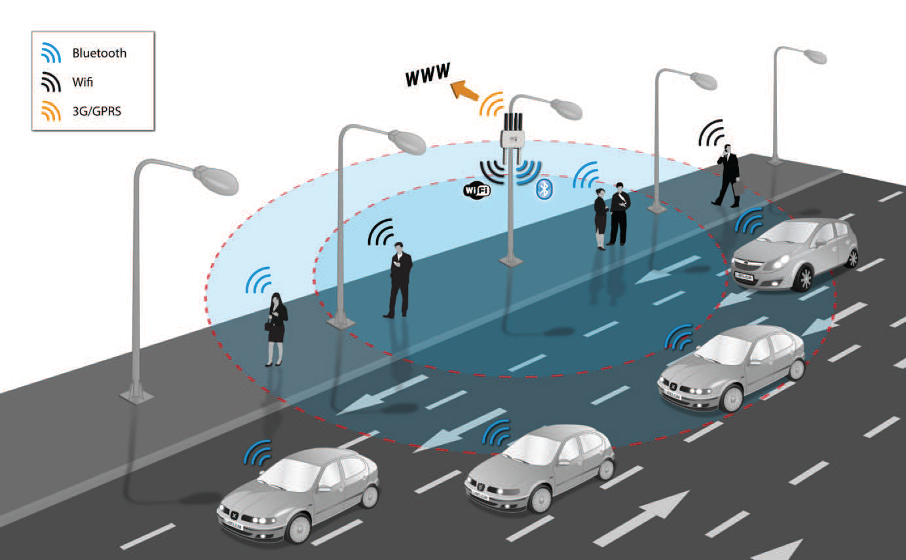
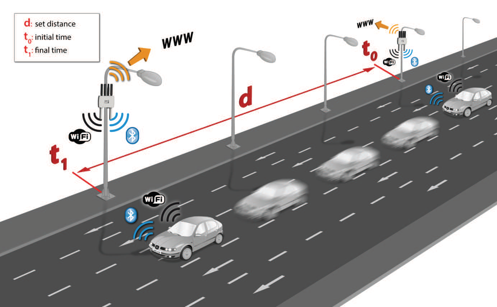
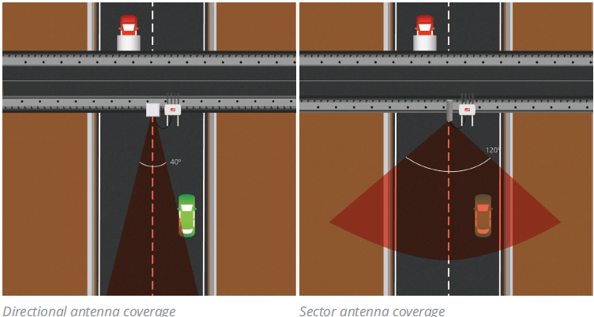

## Meshlium Technical Guide - Smartphone Detection

General idea:

* Works with iPhone and Android devices (and in general any device which works with) WiFi or Bluetooth interfaces
* No need of being connected to a specific Access Point (detection possible of e.g. smartphone, laptop, hands-free car kit device)  
* "The idea is to be able to measure the amount of people and cars which are present in a certain point at a specific time, allowing the study of the evolution of the traffic congestion of pedestrians and vehicles."

WiFi and Bluetooth radios (of devices) periodically send out messages, containing:

* **MAC address of wireless interface** \- allows to identify uniquely
* **strength of the signal (RSSI)** \- gives idea of distance of device from scanning point, usually go from \-40 dBm (nearest nodes) to \-90 dBm (farthest ones)  
* **vendor of the smartphone** (Apple, Samsung, etc.)
* **WiFi Access Point** where user is connected (if any) and **Bluetooth friendly name**
* **Class of Device (CoD)** in case of Bluetooth \- allows to differentiate type of device (smartphone, hands-free, laptop, LAN/network AP), making it possible to differentiate among pedestrians and vehicles

Coverage area:

* Can be modified by changing the power transmission of the radio interfaces (-27dBm to 3 dBm)  
* Scanning zones range from 10 to 50 m

Vehicle Traffic Detection can be used for:

* Vehicle Traffic Monitoring \- flow and congestion of vehicular traffic, flow of pedestrians
  
* Calculating the average speed of vehicles that transit over a roadway (by taking time marks at two different points)
  

### Devices detected

MAC address randomization:

* Some vendor randomize MAC addresses used when phone is not connected to a WiFi network (to fulfill privacy regulations and public concerns)
* Once a phone starts the process to connect to a WiFi network, it reverts to their **"factory" MAC address**
* Meshilum will detect "factory" MAC address when device is connected to WiFi access point (AP) and otherwise it detects randomized MAC address

Antennas:

* Meshilum kit comes with **omnidirectional antenna**  
* **Directional antennas**: extend the range of WiFi and Bluetooth scanning in the required direction in around 40°  
* **Sector antennas**: a type of directional antenna categorized by its azimuth plane width, commonly available with 60°, 90°, and 120°
  

Minimizing interference:

* Bluetooth radio integrated in Meshilum uses **Adaptive Frequency Hopping (AFH)**: algorithm that improves the common algorithm used by Bluetooth (FHSS) and enables the Bluetooth radio to dynamically identify channels already in use by XBEE and WiFi devices and to avoid them

### WiFi Scanner

The additional 2nd WiFi radio integrated in Meshlium Scanner allows to scan WiFi devices in a range of action of up to 500 m (depending on the line of sight conditions) in the 2.4 GHz and 5 GHz frequency bands.

**Anonymization of MAC addresses** (also available for Bluetooth Scanners):

* MAC addresses stored will be encoded with an MD5 hash, which changes from one day to another  
* Keeps privacy of user by not storing real MAC and not allowing to track user for more than one day

Storage of data (both are MySQL databases) \- same for Bluetooth Scanners:

* **Local database**: always used  
* **External database**: data synchronized to external database from local database

### Bluetooth Scanner

The Bluetooth radio integrated in Meshlium Scanner allows to scan Bluetooth devices in a range of action of up to 20 m depending on the line of sight conditions.

Scanning Type (specifies the use of Bluetooth Scanner):

* **Indoor type**: recommended to scan static devices or devices with slow movement, retrieves device names after about 15s of scanning  
* **Outdoor type**: focus on devices which stay a brief period of time in Bluetooth action range, does not ask device name and scanning period is about 45s
