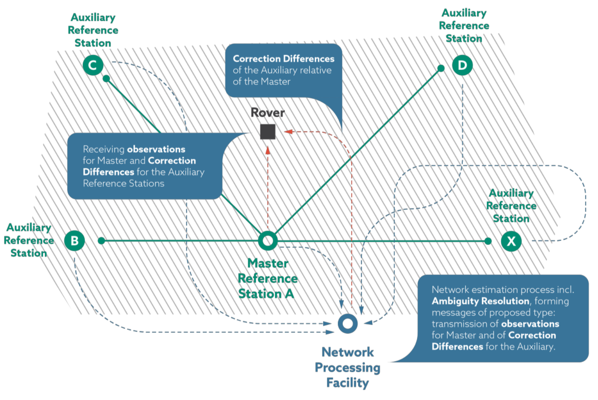

## 2 - Technical Analysis 

### Overview
- Standalone GNSS signals enable position calculation, but inherent errors limit accuracy (~4m).
- Emerging applications demand high accuracy (<1m) and real-time positioning, driving the need for signal augmentation techniques.
- Signal augmentation techniques (RTK, PPP, PPP-RTK) can deliver cm/dm level accuracy but have traditionally relied on sophisticated antennas not found in mass-market devices.
- RTK is based on the use of carrier measurements and the transmission of corrections from a base station (whose location is precisely known) to the rover (a potentially moving receiver, whose position is being determined), so that the main positioning errors can be eliminated.
- PPP is a signal augmentation technique that removes GNSS system errors to provide high accuracy positioning using only a single receiver. PPP solutions rely on GNSS satellite clock and orbit corrections, generated from a network of global Continuously Operating Reference Stations (CORS).

#### Summary of Available Signal Augmentation Technologies:
| Technology           | Errors Corrected                                          | Approach                     | Accuracy | Mean Convergence Time | Largest Service Area | Double Frequency | Required Bandwidth  | CORS Network Density Requirement (km) |
|-----------------------|----------------------------------------------------------|------------------------------|----------|------------------------|----------------------|------------------|---------------------|---------------------------------------|
| RTK                  | Orbit error, Clock error, Bias, Ionospheric delay, Tropospheric delay | OSR (Observation State Representation) | cm       | < 5s                  | Local                | Yes              | Medium              | 20 - 50                               |
| Network RTK (RS, FKP, MAC) | Orbit error, Clock error, Bias, Ionospheric delay, Tropospheric delay | OSR (Observation State Representation) | cm       | < 5s                  | Regional             | Yes              | Medium              | 70 – 100                             |
| Phase-Based PPP      | Orbit error, Clock error, Bias                            | SSR (State Space Representation) | < dm     | 20 min                | Global               | Yes              | Low                | 1000’s                              |
| Code-Based PPP       | Orbit error, Clock error, Bias                            | SSR (State Space Representation) | ~3dm     | < 1s                  | Global               | No               | Low                | 1000’s                              |
| PPP-RTK              | Orbit error, Clock error, Bias, Iono/Tropospheric delay  | SSR (State Space Representation) | < dm     | < 5s – 1 min          | Global               | Yes              | Low - Medium        | 100’s                               |

### Real-Time Kinematic (RTK)
RTK can provide very high accuracy positioning over a short range. It involves a CORS (Continuously Operating Reference Stations) transmitting its raw measurements or observation corrections to a rover receiver via a direct (two-way) communication channel. This enables the rover to resolve the ambiguities of the differenced carrier phase data and to estimate the coordinates of the rover position.

RTK is severely limited by the short coverage range (30 – 50 km), which is caused by the degradation of the distance-dependent biases. Within close proximities of the base station (10 – 20 km), RTK provides near instant, up to 1 cm + 1 ppm accuracy; however, as a direct communication channel is required between the rover and the base station, bandwidth limitations prevent large numbers of users utilising the same base station, making RTK poorly-suited to mass market applications like phones.

#### Network RTK
Network RTK (NRTK) was one of the earliest adaptations of RTK and enables the rover to connect to any CORS within an interconnected network of stations. **As the rover is no longer limited to the range of a single CORS, the coverage area of the RTK solution can be drastically improved.**

- The rover can connect to a different CORS if it is closer, retaining a high quality connection. This significantly improved RTK coverage in well-developed areas, like central Europe.
- Reduces initial cost to user as no infrastructure installation is required.
- Service subscriptions are easier for businesses to manage.

To allow a rover to switch between base stations, a standardized processing method is used across the network. This prevents the rover from reinitializing its filters with each switch. The most widely recognized standard for this is the RTCM standard.

#### Virtual Reference Station
A Virtual Reference Station (VRS) is a simulated reference point near the RTK user that combines data from multiple CORS to provide more accurate corrections. It allows greater distance from CORS, faster initialization, and more reliable signals. Even if a CORS fails, nearby stations can supply corrections.

However, VRS relies on two-way communication to generate data for specific rovers, which increases bandwidth demands. **This makes it unsuitable for mass-market use, as it could overwhelm mobile networks.**

#### Network RTK Master-Auxiliary Concept
Expanding upon the VRS technology, the RTCM SC104 committee standardised a broadcast NRTK data format, often referred to as the Master-Auxiliary Concept (MAC).

This technique uses one “Master” reference station and its raw data stream such as RTCM V3.0 message type 1004 and reduced information of other “Auxiliary” reference stations in the vicinity of the rover. The rover receiver estimates the bias around its position, using correction data with respect to at least five CORS. This technique places a greater computational load on the rover, as it shifts calculations away from the control centre.

**As MAC is based on a broadcast data format it does not require a bi-directional communication link; however, the technology is limited by the number of CORS that can be included within the data stream and additional computational requirements placed upon the rover.** The limited number of CORS stations that can be incorporated within the network restricts the serviceable area of the technology, making it **poorly suited to mass-market applications**.

{ width="600" }

#### Sensor Fusion with RTK
Inertial Navigation Systems (INS) combined with RTK are now common in products like autonomous lawn mowers and are increasingly essential for automotive use. This combination improves positioning reliability and accuracy, even when GNSS signals are temporarily lost. Adding more sensors, such as barometers and optical scene recognition, is also enhancing speed and accuracy in recent developments.

### Precise Point Positioning (PPP)
PPP is a signal augmentation technique that eliminates GNSS system errors to provide high accuracy positioning using only a single receiver. PPP solutions rely on GNSS satellite clock and orbit corrections (which are generated from a global network of CORS). **These corrections are delivered to the user via satellite or through the internet**, resulting in dm-level or better real-time positioning.

However, PPP has limitations. It estimates carrier phase errors rather than resolving them, leading to long initialization times and requiring re-initialization if the signal is lost. Typically, PPP solutions need 5-30 minutes to account for local biases like atmospheric conditions, multipath, and satellite geometry.

#### PPP-Ambiguity Resolution
PPP with Ambiguity Resolution (PPP-AR) offers faster re-initialization after signal loss compared to standard PPP. **This improvement is achieved by resolving carrier phase ambiguities within the receiver**, requiring additional observation-specific biases to be calculated and broadcast.

Similar to NRTK, PPP-AR uses a global CORS network to estimate code and phase biases alongside orbit and clock corrections, which are sent to users via communication satellites. Resulting in two key advantages: quicker recovery after GNSS data loss and higher overall accuracy.

#### Array-Aided PPP (A-PPP)
Array-Aided PPP (A-PPP) uses GNSS data from an array of antennas to provide precise **real-time orientation** and enhanced positioning. The known array geometry allows integer carrier phase ambiguity resolution, improving between-antenna GNSS pseudoranges by two orders of magnitude. Thus enable the platform to act as a 3D direction finder by determining its orientation.

Additionally, the correlation between absolute pseudoranges, carrier phases, and precise between-antenna pseudoranges improves accuracy and platform parameter estimation. Integrity is also enhanced through increased redundancy, enabling better error detection and multipath mitigation. However, the need for multiple antennas in a known formation makes this technology impractical for mass-market devices.

### Precise Point Positioning – Real-Time Kinematic (PPP-RTK)
{ width="600" }

Researchers and service providers are combining PPP and RTK into PPP-RTK to leverage the strengths of both. PPP-RTK enhances PPP by incorporating un-differenced atmospheric and satellite clock corrections from a CORS network, enabling instantaneous ambiguity fixing and shorter convergence times.

PPP-RTK uses a map of atmospheric errors generated by the CORS network. This map is most accurate near the CORS locations and degrades as the distance between the rover and CORS increases, resulting in longer convergence times. If ambiguity resolution becomes impossible (e.g., due to the rover moving beyond the network range), the system smoothly transitions to standard PPP, as the ambiguity-float PPP-RTK solution aligns with standard PPP. However, the positioning algorithms of PPP, RTK, and PPP-RTK are not interchangeable.

By using SSR corrections derived from redundant CORS, station-dependent errors like multipath are minimized. With short convergence times, efficient correction broadcasting, graceful service degradation, and low bandwidth requirements, PPP-RTK is a promising solution for mass-market applications.

### Comparison of Key Technologies
These technologies are suited to different applications based on their characteristics.

**PPP** offers global coverage with moderate positioning accuracy for an unlimited number of rovers via broadcast. Its independence from regional CORS networks allows consistent performance worldwide, making it ideal for sparsely populated areas and marine applications. While PPP provides significantly better accuracy than standalone GNSS, it falls short of RTK's precision. Additionally, PPP's long convergence times may hinder its adoption in mass-market applications.

**RTK**, on the other hand, delivers regional, near-instantaneous, high-accuracy positioning with accuracy up to 2 cm. Advances in RTK have addressed earlier range limitations, but the OSR message format remains a drawback. It requires a bidirectional communication channel between the CORS and the rover, limiting the network's capacity to support many users. This restriction makes RTK unsuitable for mass-market applications, as network bandwidth could quickly become overwhelmed.

**PPP-RTK** provides global, near-instantaneous, high-accuracy positioning for an unlimited number of users. It requires a regional CORS network with similar density to RTK to achieve best performance. If the user moves beyond the CORS network range, the solution smoothly degrades to standard PPP.

The use of SSR enables PPP-RTK corrections to be broadcast with lower bandwidth requirements than OSR, allowing for an unlimited number of users. These features make PPP-RTK well-suited for mass-market applications.

**Some experts do not believe that PPP-RTK offers a significant improvement over NRTK as they are both reliant upon a CORS network. Within regions with well-established CORS networks, PPP-RTK and NRTK are expected to deliver comparable results.**

### Message Format
{ width="600" }

