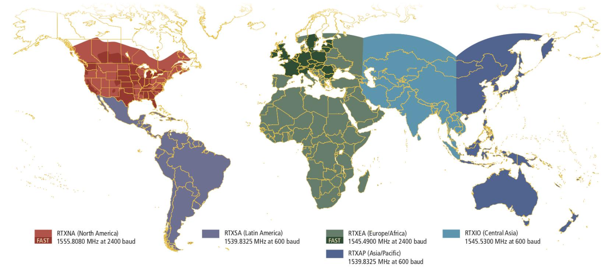

## 4 - Competitive Landscape
In my opinion, this chapter isn't as important as the others, as it focuses more on market trends and service providers rather than the concepts of the technology itself. I didn’t include all the content in these notes, but if you think it's relevant to you, I recommend taking a closer look at the document.

### Overview
The market for high accuracy GNSS applications is mature in the professional field, with applications in sectors like mapping, surveying, GIS, mining, and agriculture. Current service providers offer a range of solutions, including SBAS, RTK, DGNSS, and PPP, with innovative concepts like PPP-RTK emerging. However, these services are currently focused on professional applications due to hardware limitations in mass-market receivers.

### Current State of PPP-RTK Technology
*   **Regionally developed services:** Some regional authorities have developed their own signal augmentation services, including Japan's QZSS CLAS and a trial operation by the Bavarian State Office for Survey and Geoinformation. These initiatives demonstrate the growing interest in PPP-RTK at a governmental level.
*   **Emerging commercial services:** Companies like Trimble are beginning to offer PPP-RTK services in regions with well-established CORS networks. The success and effectiveness of these early deployments will likely determine the future growth and adoption of PPP-RTK.
*   **Key Examples:** The section provides detailed case studies of several PPP-RTK services, including:
    *   **FLAMINGO H2020:** This EU-funded project focuses on delivering high-accuracy positioning to mass-market devices like smartphones and IoT devices.
    *   **QZSS CLAS:** Japan's QZSS CLAS service utilizes L6 signals to provide centimeter-level augmentation information, targeting professional markets.
    *   **Trimble CentrePoint RTX – Fast Regions:** Trimble's service leverages its existing RTX technology to offer high-accuracy positioning via satellite or internet globally.
    *   **Teria-Exagone:** This French service combines NRTK and PPP-RTK corrections for increased availability and precise positioning with integrity calculations.
    *   **Fugro Marinestar G4+:** Based on the uncalibrated phase delay approach, this service utilizes a global network of reference stations to estimate UPDs and achieve high accuracy.
    *   **Geo++:** This company, instrumental in the development of SSR data format, is also exploring the deployment of RTK on smartphones.

{ width="500" }

### Conclusions
European market is currently a leader in the high-accuracy signal augmentation industry. This is due to several factors:

* Well-established CORS network across the continent 
* High availability of advanced technologies 
* Strong industry leadership
* Highly developed service providers

While the emergence of **PPP-RTK is not expected to cause a major disruption** to the market in the short term, the introduction of **Galileo HAS will likely have a significant impact.** This is because Galileo HAS:

* Will be a free and open service 
* Will compete with existing commercial solutions 
* Is expected to be well received by the industry

Commercial service providers may need to adapt to the presence of Galileo HAS by focusing on specific applications or additional functionality to maintain their market share.
