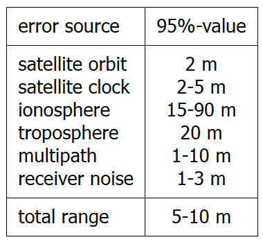
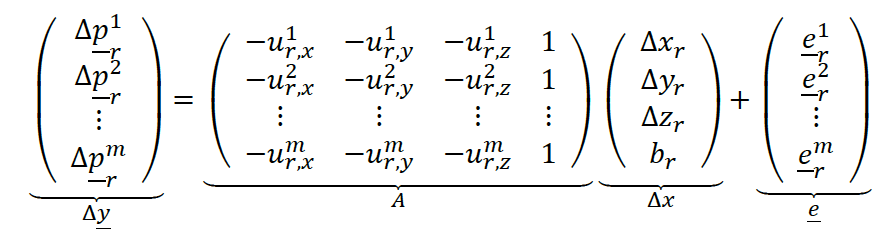

## 14 - Positioning

### 14.1 - Geometric interpretation

The GPS pseudorange measurement relates to the geometric range(distance) from satellite to receiver but is also caused by the **receiver clock offset**. The receiver clock offset is the **same** for all pseudoranges measured by the receiver at a specific time.

In two dimensions, we would need to solve for **two receiver position coordinates** and **one receiver clock error**, hence in total **three unknown parameters**, so we need at least three pseudorange measurements:

$$\underline{\varphi}_r^s = \sqrt{(x^s - x_r)^2 + (y^s - y_r)^2 + (z^s - z_r)^2} + b_r + d_r^s + \lambda N_r^s + \underline{e}_r^s$$

The measured pseudoranges must be reduced or enlarged with exactly the same amount to **meet at one physical position**. The amount to make that happen is the **receiver clock offset**.

### 14.2 Pseudorange observation equation

{width="250"}

* $br$: is **positive** if the receiver clock is ahead of GPS system time, and the measured pseudoranges are **‘too long’**.
* ers: unavoidable random measurement error

### 14.3 Positioning: parameter estimation

GPS positioning employs the principle of least squares estimation. Since the GPS observation model is **nonlinear**, this involves a **linearisation** for the unknown parameters, around an approximate position. The linearized model of observation equations reads:

{width="500"}

Next, a **leastsquares algorithm** is used to solve this linearized model, presented in matrix-vector form, where a **Best Linear Unbiased Estimation** solution can be obtained.

**NMEA** is a well-known and widely used format for storing and exchanging GPS (GNSS) Position, Velocity and Time (PVT) solutions.

### 14.4 - Reference systems

By default, **GPS positioning** yields Cartesian coordinates (𝑥, 𝑦, 𝑧) in **WGS84**.

In **differential mode**, the position coordinates:

* Are generally provided in **a local or regional reference system**(e.g. ETRS89 in Europe).
* For the user receiver is in the same reference system as the position coordinates of the base, or reference station.

### 14.5 - GPS accuracy and error sources

The quality of the GPS position solution is largely dependent on:

* The number of **available satellites** (enough satellites are visible)
* Their **geometry** with respect to the user (On all sides of the receiver at high and low elevation angles)

No satellites are visible **beneath** the receiver (below the local horizon): vertical position accuracy is generally poorer than horizontal accuracy by about **a factor of 1.5**.

The accuracy of standalone positioning with GPS is in the order of **5-15 meters** under reasonable satellite visibility.

The GPS pseudorange measurements contain **errors** due to:

* Inaccurate satellite orbit and clock information,
* delays along the path of the radio signal:
  * **atmospheric delays** (ionosphere and troposphere),
  * **local effects** including multipath,
  * and **measurement noise**

$$\underline{p}_r^s = \sqrt{(x^s - x_r)^2 + (y^s - y_r)^2 + (z^s - z_r)^2} + b_r + \underline{e}_r^s$$

Local effects:

* **Shadowing:** one or more satellite signals are blocked by surrounding obstacles.
* **Signal reflections:** signals arrive at the receiver after bouncing off an object.
* **Multipath:**  both the direct and reflected signals arrive at the receiver

### 14.6 - Standalone positioning: example

*Nothing interesting.*
