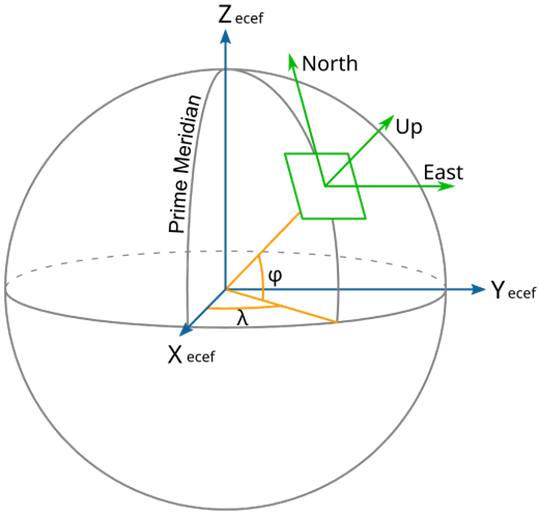
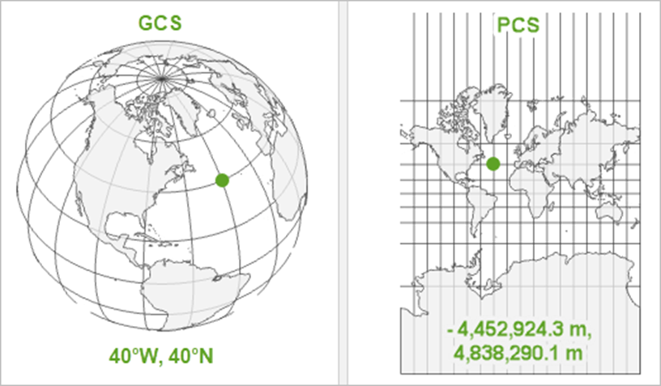
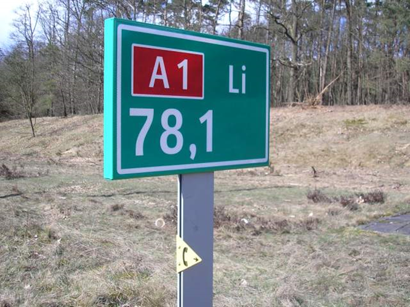

## Coordinate Systems

### Coordinate Reference Systems

According to the EPSG and ISO guidelines, four groups of CRSs can be distinguished:

* **Geographic CRSs** give geographic coordinates in degrees (2D latitude and longitude, and for 3D also height) relative to an ellipsoidal model of the Earth's surface. Examples include the European ETRS89, the global ITRF2020, and WGS 84. Geographic CRSs, such as ETRS89 and WGS 84, cannot be visualized on a flat plane without a map projection.
* **Projected CRSs** present geo-information on a flat surface in Cartesian (x and y) coordinates. A projected CRS is a derivative of a geographic CRS, where a map projection is used for the depiction on the flat surface. An example of this is the Dutch RD with the geographic CRS RD-Bessel as its basis.
* **Vertical CRSs** for recording height and depth relative to a reference plane. This reference plane is often based on the direction of gravity and normally does not coincide with the surface of an ellipsoid. With a reference plane based on the direction of gravity, no water flows between two points of equal height, but water usually does flow between two points of equal ellipsoidal height. Examples of vertical CRSs are the NAP and the LAT.
* **Compound CRSs** are composite CRSs, for example: RDNAP which is composed of the projected CRS RD and the vertical CRS NAP.

In this chapter of the summary, we will highlight two examples of Coordinate Reference Systems. Before doing so, here is an overview of some terminology and their examples:

**Geodetic terminology**

* Terrestrial Reference System (definition) (e.g. ETRS89, WGS84)

* Terrestrial Reference Frame (realisation) (e.g. ETRF2000, ITRF2020)

* Ellipsoid (e.g. GRS80, Bessel 1841)

* 'Coordinate notation’ (e.g. axis, order, units)

* Map projection (optional) (e.g. UTM, LCC)

* Epoch (for time-dependent coordinates) (e.g. 2024.91 (27 November 2024)

NB: be aware of the difference between epoch and the year in names!

**Geo-spatial terminology**

* Datum ensemble != Terrestrial Reference System

* Datum = Terrestrial Reference Frame + ellipsoid

* Coordinate system = Coordinate notation (+ map projection)

* CRS (= projection in some software) = datum + coordinate system

### Geographic Coordinate Reference Systems

The use of Geographic Coordinate Reference Systems is very common. They use degrees of latitude and longitude and sometimes also a height value to describe a location on the earth’s surface.

**Lines of latitude** run parallel to the equator and divide the earth into 180 equally spaced sections from North to South. The reference line for latitude is the equator and each **hemisphere** is divided into ninety sections, each representing one degree of latitude. Wherever you are on the earth’s surface, the distance between the lines of latitude is the same (60 nautical miles).

**Lines of longitude**, on the other hand, do not stand up so well to the standard of uniformity. Lines of longitude run perpendicular to the equator and converge at the poles. The reference line for longitude (the prime meridian) runs from the North Pole to the South Pole through Greenwich, England. At the equator, and only at the equator, the distance represented by one line of longitude is equal to the distance represented by one degree of latitude.

Using the geographic coordinate system, we have a grid of lines dividing the earth into squares that cover approximately 12363.365 square kilometres at the equator — a good start, but not very useful for determining the location of anything within that square. To be truly useful, a map grid must be divided into small enough sections so that they can be used to describe (with an acceptable level of accuracy) the location of a point on the map. To accomplish this, degrees are divided into **minutes** (') and **seconds** ("). There are sixty minutes in a degree, and sixty seconds in a minute (3600 seconds in a degree). So, at the equator, one second of latitude or longitude = 30.87624 meters.

{width:"50%"}

### Projected Coordinate Reference Systems

There is a difference between a geographic coordinate system (GCS) and a projected coordinate system (PCS). In short, a GCS defines **where** the data is located on the earth’s surface; a PCS tells the data **how** to draw on a flat surface. A GCS is round, and so records locations in angular units (usually degrees). A PCS is flat, so it records locations in linear units (usually meters).
{width:"50%"}

The GCS is what ties your coordinate values to real locations on the earth. Only knowing the latitude and longitude of a location is thus not good enough, as it only tells you where a location is within a GCS. To draw a graticule, you need a model of the earth that is at least a regular spheroid, if not a perfect sphere. There are many different models of the earth’s surface, and therefore many different GCS!

Once you know where to draw something, you need to know how. The earth’s surface — and your GCS — are round, but the map is flat. This is where the map projections come in. They tell you how to distort the earth so the parts that are most important to your map get the least distorted and are displayed best on the flat surface of the map. A **projected coordinate system** (PCS) is a GCS that has been flattened using a map projection.

Your data must have a GCS before it knows where it is on Earth. Projecting your data is optional, but projecting your map is not. Maps are flat, so your map must have a PCS to know how to draw.

Coordinates in a PCS are recorded in **a Linear Unit**, often meters. A PCS also contains a Geographic Coordinate System (e.g. WGS 1984)! Remember that a PCS is just a GCS that has been projected.

Coordinates in a GCS are recorded in an Angular Unit, usually degrees. The **Prime Meridian** is an arbitrary line of longitude that is defined as 0°. The **Datum** defines which model is used to represent the earth’s surface and where that model is positioned relative to the surface. The **Spheroid** is the regular model of the irregular earth. It’s part of the datum. **Semimajor Axis, Semiminor Axis**, and **Inverse Flattening** define the size of the spheroid.

### Linear Reference Systems

**Linear referencing** is the method to store and geographically locate data using relative positions along a measured line feature without the need to explicitly use x,y coordinates or an address. When data is linearly referenced, measure values are used to measure the distance along a line feature, allowing multiple sets of dynamically changing attribute data to be associated with any portion of an existing linear feature, independent of its beginning and end. Linear referencing is used for many reasons. The following are the two primary reasons:

* Many locations are recorded as events along linear features.

>For example, locations of traffic accidents are recorded using a convention such as "27 meters east of reference mile marker 35 along State Highway 287." Many sensors record conditions using measures of distance or time along the lines—along pipelines, along roads, along streams, and so forth.

* Linear referencing is also used to associate multiple sets of attributes to portions of linear features without requiring that underlying lines be segmented (split) each time that attribute values change.

>For example, most road centreline feature classes are segmented where three or more road segments intersect and where the road names change.

{width:"50%"}

Great examples of Linear Reference Systems are the Dutch **hectometre markers**. As the name suggests, Dutch hectometre markers are spaced at 100-metre intervals. In addition to showing the motorway number and location, they also bear a **carriageway identifier** – Li for Links (Left) and Re for Rechts (Right). The carriageways are identified as being left-hand and right-hand as viewed by somebody looking in the direction of increasing location numbers. By and large, Dutch location numbers increase as one moves away from Amsterdam, or in the case of roads that do not originate in Amsterdam, location numbers increase as one moves eastwards away from the North Sea.

**Dynamic segmentation** is the process of computing the map locations of events stored and managed in an event table and displaying them on a map using route features. The term dynamic segmentation is derived from the concept that line features need not be split (in other words, segmented) each time an attribute value changes; you can dynamically locate the segment.

Using dynamic segmentation, multiple sets of attributes can be associated with any portion of an existing linear feature independently of where it begins or ends. These attributes can be displayed, queried, edited, and analyzed without affecting the underlying linear feature's geometry.
