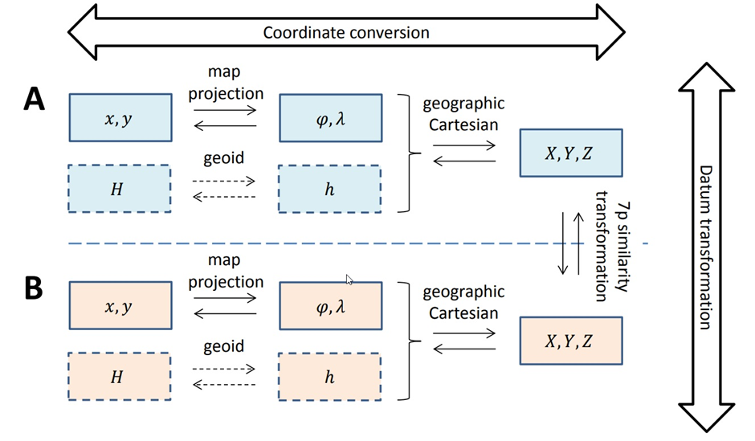
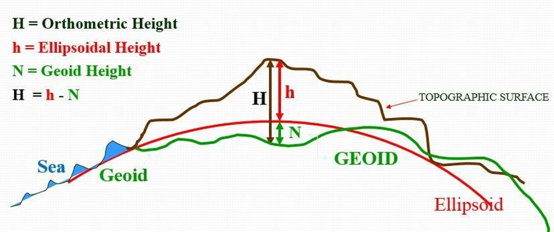

## Datum and Transformations

### Transformations and conversions

The International Association of Oil and Gas Producers (EPSG) used a _de facto_ standard instead of an ISO standard. The EPSG collects all the different reference systems and their transformations. There are two different steps when working with 3D data. First, the coordinates need to be converted to a new coordinate system, after which the height values are transformed.

{width="400"}

Note, that a geoid is a stochastic height transformation and not a conversion. It uses in total 14 parameters:

* 7 parameters;
  * 3 Translations \[m\];
  * 3 Rotations \[“\];
  * 1 Scale factor \[ppm\];
* 7 rates and reference epoch (t0).

These parameters can be given (by an official source), user-estimated (empirical) and/or conventional (by definition). A correction grid can be used as an alternative transformation or an additional conversion.

A big difference between datum transformations and coordinate conversions is that the parameters for the datum transformation are often empirically determined and thus subject to measurement errors, whereas coordinate conversions are fully deterministic. More specific, three possibilities need to be distinguished for the datum transformation parameters:

1. **The datum transformation parameters are conventional**. This means they are chosen and therefore not stochastic. The datum transformation is then just some sort of coordinate conversion (which is also not stochastic).

2. **The datum transformation parameters are given but have been derived by a third party through measurements**. This third party often does new measurements and updates the transformation parameters occasionally or at regular intervals. This is also related to the concepts of reference systems and reference frames. Reference frames are considered (different) realisations of the same reference system, with different numerical values assigned to the coordinates of the points in the reference frame, and often with different realisations of the transformation parameters. The station coordinates and transformation parameters are stochastic, so new measurements, mean new estimates that are different from previous estimates.
3. **There is no third party that has determined the transformation parameters, and you as a user, have to estimate them using at least three common points in both systems**. In this case you will need coordinates from the other reference system. Keep in mind that the coordinates from the external reference system should all come from the same realization, or, reference frame.

## Datums

When people in the field of Geomatics are talking about height, they can reference multiple different definitions of height:

* **Geometric**: Ellipsoidal height (max. MSL deviation ±150m)

* **Physical**: Height above the geoid ≈ Mean Sea Level (MSL)
* **Relative**: Height above ground level (DTM)
* **Water depth**: Lowest Astronomical Tide (LAT)

{width="400"}

There are multiple physical height standards depending on where you want to know the height:

* **International Height Reference Systems** (IHRS) – No realisation yet

* **European Vertical Reference System** (EVRS) – Realisations available, but not widely used yet (dm – cm)

* **Earth Gravitation Model** (EGM84, 96, 2008, 2020) – By USA like WGS84 (m – dm)

* National Height Systems – Based on local MSL
