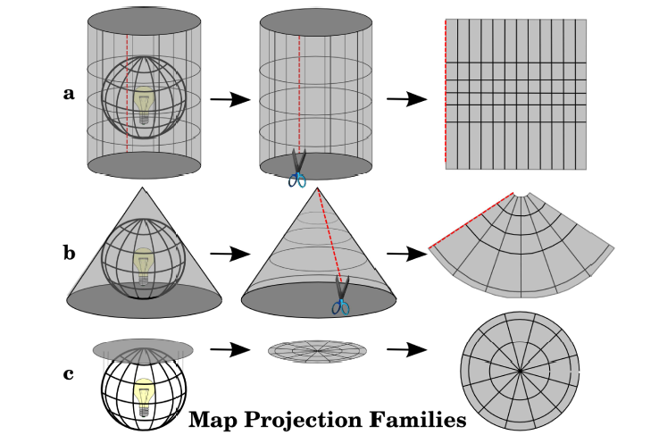
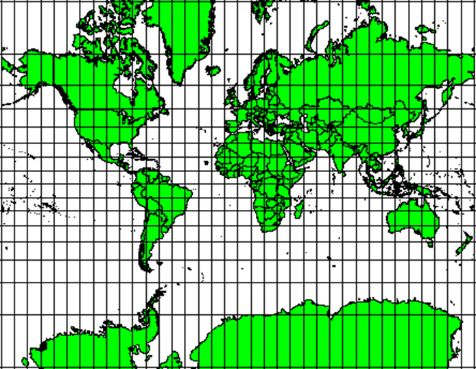
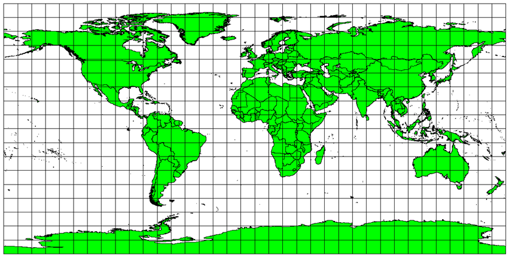
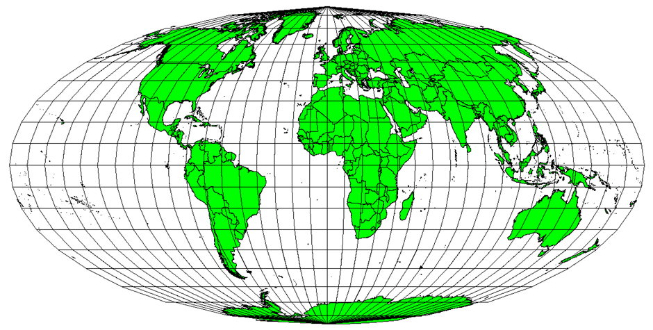

## Map Projections

**Map projections** try to portray the surface of the earth or a portion of the earth, on a flat piece of paper or computer screen.They try to transform the earth from its spherical shape (3D) to a planar shape (2D).

**A coordinate reference system** (CRS) then defines how the two-dimensional, projected map relates to real places on Earth. The decision of which map projection and CRS to use depends on the regional extent of the area you want to work in, on the analysis you want to do, and often on the availability of data.

When viewed at close range the earth appears to be relatively flat. Maps are representations of reality: they are designed to not only represent features but also their shape and spatial arrangement. Each map projection has **advantages** and **disadvantages**.

The best projection for a map depends on the **scale** of the map, and on the purposes for which it will be used. For example, a projection may have unacceptable distortions if used to map the entire African continent but may be an excellent choice for a **large-scale (detailed) map** of your country.

Different projection methods can be produced by surrounding the globe in a **cylindrical** fashion, as a **cone**, or even as a **flat surface**. Each of these methods produces what is called a **map projection family**. Therefore, there is a family of **planar/azimuthal projections (c)**, a family of **cylindrical projections (a)**, and another called **conical projections (b).**

{width:"50%"}

Map projections are never absolutely accurate representations of the spherical Earth. As a result of the map projection process, every map shows **distortions of angular conformity, distance and/or area**. It is usually impossible to preserve all characteristics at the same time in a map projection. This means that when you want to carry out accurate analytical operations, you need to use a map projection that provides the best characteristics for your analyses.

When working with a globe, the main directions of the compass (North, East, South and West) will always occur at 90 degrees to one another. In other words, the East will always occur at a 90-degree angle to the North. Maintaining correct **angular properties** can be preserved on a map projection as well. A map projection that retains this property of angular conformity is called a **conformal** or **orthomorphic projection**. These projections are used when the **preservation of angular relationships** is important. They are commonly used for navigational or meteorological tasks.

{width:"50%"}

If your goal in projecting a map is to accurately measure distances, you should select a projection that is designed to preserve distances well. Such projections, called **equidistant projections**, require that the **scale** of the map is **kept constant**. A map is equidistant when it correctly represents distances from the centre of the projection to any other place on the map.**Equidistant projections** maintain accurate distances from the centre of the projection or along given lines. These projections are used for radio and seismic mapping, and navigation.
{width:"50%"}

When a map portrays areas over the entire map, so that all mapped areas have the same proportional relationship to the areas on the Earth that they represent, the map is an **equal area map**. As the name implies, these maps are best used when calculations of area are the dominant calculations you will perform. If, for example, you are trying to analyse a particular area in your town to find out whether it is large enough for a new shopping mall, **equal area projections** are the best choice. On the one hand, the larger the area you are analysing, the more precise your area measures will be, if you use an equal area projection rather than another type. On the other hand, an equal area projection results in **distortions of angular conformity** when dealing with large areas.

{width:"50%"}
