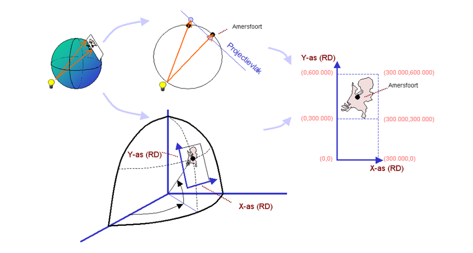
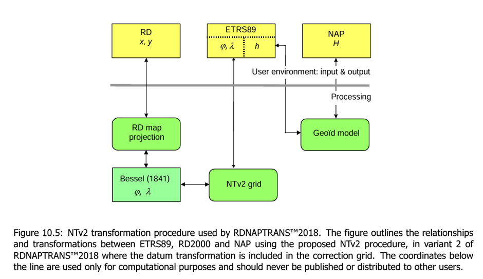
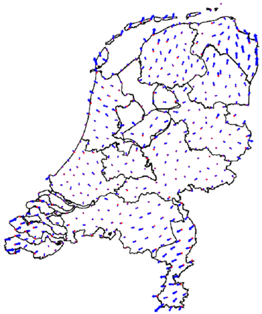

## RDNAP
The national height system in the Netherlands is called **Normaal Amsterdams Peil (NAP)** and is based on the average summer flood in 1683-1684. Maintenance is based on point stability and it uses the NLGEO2018 geoid for GNSS measurements. Values range between 39.1 – 48.7m.

For parts of the Noordzee however, the NAP cannot be used. Instead, they use the **Lowest Astronomical Tide** (LAT), which is the water depth in Worst-case astronomical conditions and average meteorological conditions.

The **Stelsel van de Rijksdriehoeksmeting (RD)** was created using triangulation from church spires and stone markers (historical), but nowadays is derived from ETRS89 with RDNAPTRANS. It has no time dependence; the differences are <1cm since 2000. It uses one EPSG-code (EPSG:28992 (RD New) for 2D and EPSG:7415 for compound CRS with NAP). The RD projection has its origin in Amersfoort in the middle of the Netherlands, it uses conformal stereographic projection (angles are preserved) and the north of the map is not equal to the true north. Unlike what you might think, the highest accuracy is not in Amersfoort itself, but rather in a circle ~100km around it.

{width:"50%"}

To prevent confusion between the x-coordinates and y-coordinates, and to obtain always positive coordinates, the origin of the coordinates was shifted 155 km to the West and 463 km to the South (**False Easting and Northing**). This resulted in only positive x- and y-coordinates, where the y-coordinates are always larger than the x-coordinates.

**RDNAPTRANS** is the transformation between ETRS89 and RD NAP. It uses a Datum transformation and a correction grid (see fig.) in combination with the map projection to transform the values. The height of the transformation is determined by a quasi-geoid.

{width:"50%"}

Below are the errors of the RDNAPTRANS:
{width:"50%"}