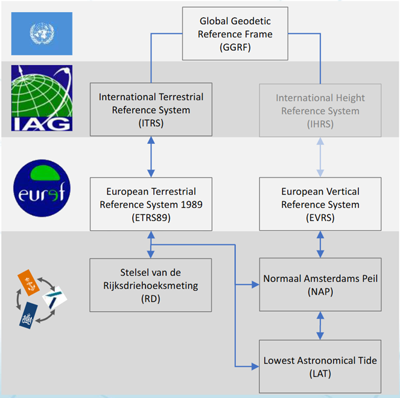
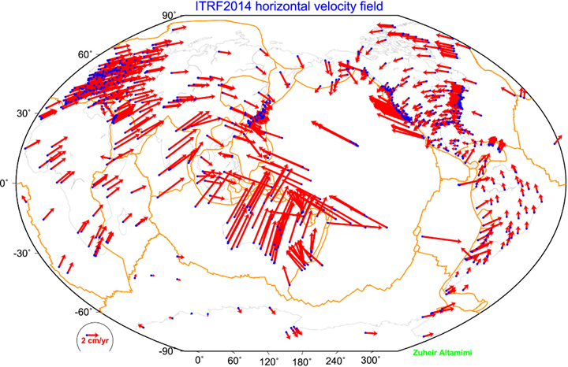

<!--AUTOMATICALLY GENERATED
**********************************************************************
*                                                                    *
*    This file was automatically generated by copying                *
*    'content/notes/crs/terrestrial_reference_frames_systems.md'.    *
*    If you want to manually overwrite it, you have to remove t      *
*    his whole comment. Otherwise, it will be overwritten the n      *
*    ext time any change happens in the notes.                       *
*                                                                    *
**********************************************************************
-->

## Terrestrial Reference Systems and Frames
In this chapter of the summary, we will highlight some examples of Coordinate Reference Systems and Frames:

**ITRS: International Terrestrial Reference System** uses the GRS80 ellipsoid, with as its origin the centre of mass of the Earth. Greenwich (UK) is used as a meridian. When using time-dependent coordinates, you always need to specify the epoch (e.g. @2024.91).

**ITRF: International Terrestrial Reference Frames** are realisations of the ITRS. They publish updates every ~1-6 years. Due to the movement of tectonic plates, the differences between each iteration can be multiple centimetres to decimetres. Two examples are ITRF2014 and ITRF2020 (NB: Frame ≠ epoch, e.g. ITRF2014@2022.90). These updates reflect:

* Improved precision of the station positions 𝐫(𝑡0) and velocities 𝐫̇ due to the availability of a longer period of observations, which is particularly important for the velocities,

* Improved datum definition due to the availability of more observations and better models,

* Discontinuities in the time series due to earthquakes and other geophysical events,

* Newly added and discontinued stations,

* Occasionally a new reference epoch 𝑡0.

**WGS 84** is aligned with ITRS (WGS 84-G2296 (2024) = ITRF2020). For time-dependent coordinates, however, it has limited precision. The realisations (frames) often have differences between m – cm. The ensemble code (± 2m): EPSG:4326 for 2D (often used as unknown latlon).

**ETRS89: European Terrestrial Reference System 1989** is ITRF89 at epoch 1989.00. It moves with a stable part of Europe, “no” time-dependency. A new realisation (frame) comes with every ITRF. ETRF2000 is recommended for mapping and the ensemble code has an accuracy of ± 0.1m.

A transformation from ETRS89 to ITRS (and WGS84) is an example of a **Time-dependent transformation** (2.4 cm/year), but a specification of realisation and epoch is needed and most software does not include this transformation. A **Null transformation** is possible, simple and the current practice, but it is not future-proof, since the difference is growing (now 0.9m).
