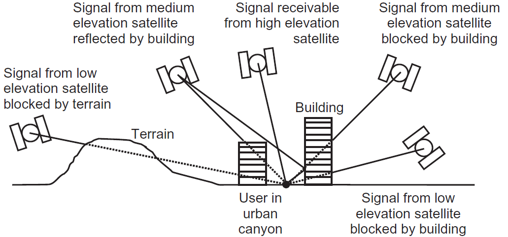

## Error Sources

### Pseudorange Calculation

Multiple issues affect the calculation of the pseudorange:

- the **satellite clock** has an **offset**, which is *known* (part of the navigation message)
- the **receiver clock** has an **offset**, which is *unknown*
- the **ionosphere** causes a delay (due to a lower speed of light), which is *unknown*
- there might be other errors, such as multipath, which are unknown

Any of these issues will cause the calculated pseudorange to be **inaccurate**. The calculation is very sensible since $c \approx 3 \times 10^8 \, \text{m/s}$, and a **1 µs** error will cause a **300 m** error in the calculated distance, since we have:

$$
p_{r,s} = r_{r,s} + c \cdot (\delta t_s - \delta t_r)
$$

where:

- $p_{r,s}$: pseudorange
- $r_{r,s}$: actual range
- $\delta t_s$: satellite clock offset
- $\delta t_r$: receiver clock offset

### Ionosphere Delay

One of the *major error sources* in GPS is due to the **ionosphere**, which contains *free electrons* that cause the speed of light to be lower than in vacuum.

The ionospheric delay may be **highly variable**, as a function of both **time** and **space**. In terms of distance ranging, it can go from *a few meter to hundreds of meters*, and is maximum round the geomagnetic equator around local noon, and during solar maxima.

The ionosphere delay scales, to a very good approximation, with the **inverse of the square of the radio frequency** of the signal, so using two different frequencies allows to create the so­-called *ionosphere-­free range measurements*. This is why GPS satellites were originally designed to transmit ranging signals on both the **L1** (1575.42 MHz) and **L2** (1227.60 MHz) frequency.

### Masking Angle

GNSS receivers **ignore signals** from below a certain elevation, making them prone to errors (typically between 5° and 15°).

{width=500px}

### GNSS Augmentation Systems

**GNSS augmentation systems** supply differential corrections and integrity alerts that meet the needs of safety-critical applications. There are two types:

| Criteria | **Space-based augmentation systems (SBAS)** | **Ground-based augmentation systems (GBAS)** |
|----------|----------------------------------------|----------------------------------------|
| *Coverage* | Large country or small continent | Local area (e.g. an airfield) |
| *Broadcast* | Geostationary satellites | Ground-based transmitters |
| *Precision* | Lower than GBAS | Higher than SBAS |
