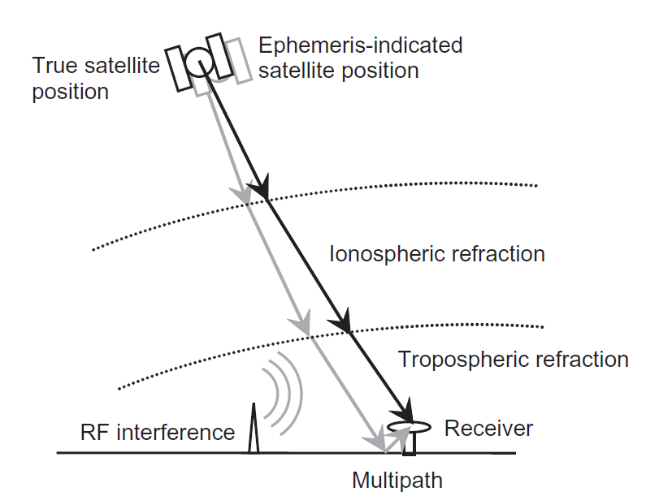

## Error Sources

{width=400px}

### Pseudorange Calculation

Multiple issues affect the calculation of the pseudorange:

- **satellite clock offset** (known).
- **receiver clock offset** (unknown).
- **ionosphere delay** (unknown).
- other errors, such as *multipath* (unknown).

The calculation is very sensible since $c \approx 3 \times 10^8 \, \text{m/s}$, and a **1 µs** error will cause a **300 m** error in the calculated distance, since we have:

$$
p_{r,s} = r_{r,s} + c \cdot (\delta t_s - \delta t_r)
$$

where:

- $p_{r,s}$: pseudorange
- $r_{r,s}$: actual range
- $\delta t_s$: satellite clock offset
- $\delta t_r$: receiver clock offset

### Ionosphere Delay

Ionospheric delay:

- Is due to **free electrons** in the ionosphere.
- Is highly variable (depends on **time** and **space**).
- Ranges from *a few meters to hundreds of meters*.
- Is maximum near geomagnetic equator, around local noon and during solar maxima.
- Is proportional to $1 / \text{frequency}^2$.
- Can be estimated using two frequencies. This is why satellites emit at **L1** (1575.42 MHz) and **L2** (1227.60 MHz).

### Masking Angle

GNSS receivers **ignore signals** from below a certain elevation, making them prone to errors (typically between 5° and 15°).

{width=500px}

### GNSS Augmentation Systems

**GNSS augmentation systems** supply differential corrections and integrity alerts that meet the needs of safety-critical applications. There are two types:

| Criteria | **Space-based augmentation systems (SBAS)** | **Ground-based augmentation systems (GBAS)** |
|----------|----------------------------------------|----------------------------------------|
| *Coverage* | Large country or small continent | Local area (e.g. an airfield) |
| *Broadcast* | Geostationary satellites | Ground-based transmitters |
| *Precision* | Lower than GBAS | Higher than SBAS |
