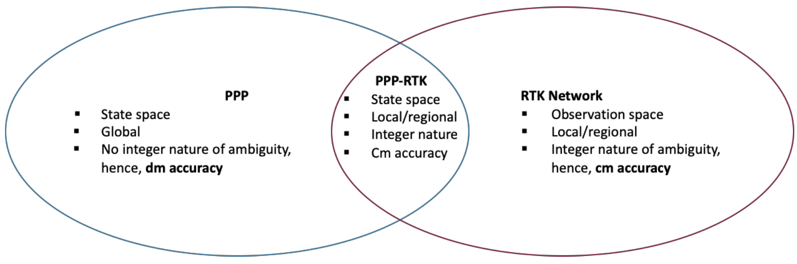
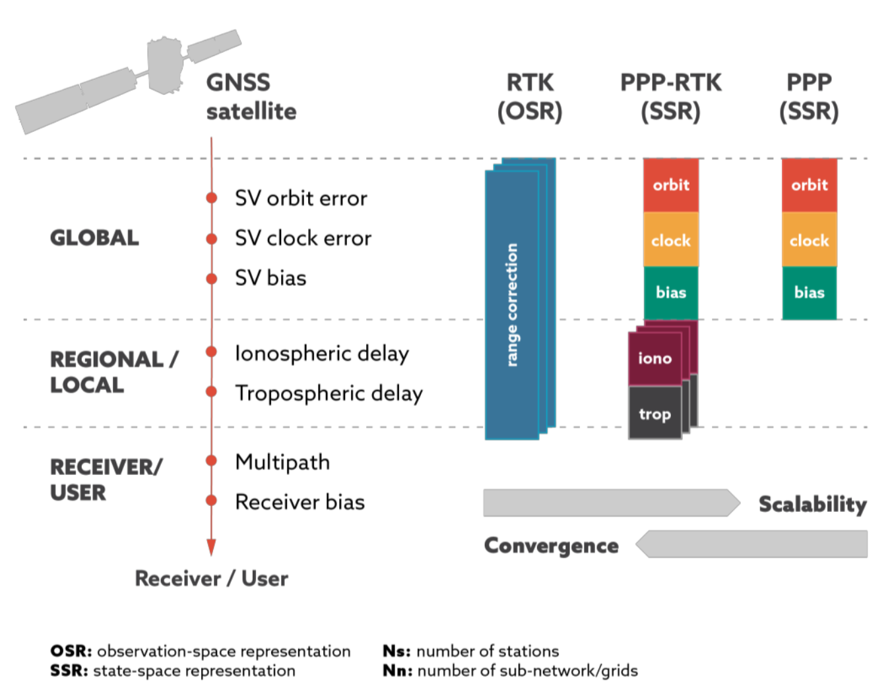

## PPP-RTK

### PPP

Precise Point Positioning (PPP) is a GNSS signal augmentation technique that offers high accuracy positioning using a single receiver. The errors which PPP corrected:

- satellite errors
  - SV Orbit error
  - SV Clock error
  - SV Bias

#### Key features of PPP

- **Does not resolve carrier phase ambiguities** \
    Instead, it uses an estimation, leading to a longer initialization time and requiring full re-initialization if the signal is lost. This is a key difference from RTK, which uses carrier phase measurements for precise positioning.
- **Eliminates GNSS system errors** \
    PPP uses GNSS satellite clock and orbit corrections to achieve high-accuracy positioning without needing a local base station. PPP typically offers a decimetre accuracy (10 cm).
- **Relies on a global network of Continuously Operating Reference Station (CORS)** \
    These stations generate the corrections needed to eliminate system errors.
- **Delivers corrections via satellite or internet** \
    This allows for global coverage and removes the need for local infrastructure.
- **Provides dm-level or better real-time positioning** \
    This accuracy surpasses standalone GNSS capabilities, making it suitable for applications requiring higher precision.
- **Requires a convergence period** \
    Typically ranging from 5 to 30 minutes, this time is needed to resolve local biases such as atmospheric conditions, multipath, and satellite geometry.
- **Uses the State Space Representation (SSR) message format** \
    This format separates and corrects individual error components, unlike OSR used in RTK.
- **Suitable for applications with no local infrastructure** \
    Ex: sparsely populated areas and marine applications where setting up a network of base stations is challenging.

While PPP offers global coverage and good accuracy, its long convergence times can be a drawback for applications that require rapid positioning. Nonetheless, it's a valuable technique for situations where high accuracy is needed without relying on local base stations.

### RTK

RTK, which utilises the OSR approach, corrects for location-dependent errors like Ionospheric and Tropospheric delays by providing a localized solution based on a network of base stations (CORS). The errors which RTK corrected:

- satellite errors
  - SV Orbit error
  - SV Clock error
  - SV Bias
- location-dependent errors
  - Ionospheric delay
  - Tropospheric delay

#### Key features of RTK

- **RTK enables the rover to resolve the ambiguities of the differenced carrier phase data and estimate the coordinates of the rover position.**
- **A CORS transmits its raw measurements or observation corrections to a rover receiver.** \
    This is done via a direct (two-way) communication channel. The rover is a potentially moving receiver whose position is being determined.
- **Very high accuracy positioning over a short range (30–50 km).** \
    This is due to the degradation of distance-dependent biases, such as orbit error and ionospheric and tropospheric signal refraction.
- **Within close proximities of the base station (10–20 km), RTK provides near-instant high accuracy positioning of up to 1 cm + 1 ppm.**
- **A direct communication channel is required between the rover and the base station.** \
    Bandwidth limitations prevent large numbers of users utilising the same base station, making RTK ill-suited to mass-market applications.
- **RTK is the most popular GNSS signal augmentation technology.** \
    It is used in industries such as surveying and agriculture, and is especially common in regions with well-developed CORS networks.
- **RTK uses the Observation Space Representation (OSR) approach.** \
    This groups the errors together and provides the total correction measurements, rather than for the individual parameters. All parameters are updated at the same frequency regardless of their time sensitivity.

#### OSR Approach

Some of the key features of RTK are closely related to its OSR (Observation Space Representation) approach. OSR groups the errors together and provides the total correction measurements, rather than for the individual parameters.  All parameters are updated at the same frequency regardless of their time sensitivity.

The OSR approach (and thus RTK) has high bandwidth requirements because:

- **It requires a two-way communication channel for each user.** \
    Both the base station and the rover need to transmit data back and forth, increasing the amount of data being transferred.
- **OSR groups errors together and provides total correction measurements.** \
    Instead of sending corrections for individual parameters separately, OSR sends all the corrections together. This leads to a larger data packet size compared to SSR, which separates individual error components.
- **All parameters are updated at the same frequency.** \
    Regardless of the time sensitivity of each parameter, they are all updated at the same rate (the most time-sensitive one), leading to more frequent data transmissions and increased bandwidth usage.

The high bandwidth requirement of OSR is a major limitation, particularly for mass-market applications. If a large number of users were to utilise the OSR approach, current mobile networks would likely be overwhelmed. This is why OSR is not well-suited for applications like smartphones, IoT, and the automotive industry.

### PPP-RTK

PPP-RTK is a hybrid GNSS signal augmentation technology that combines the strengths of both Precise Point Positioning (PPP) and Real-Time Kinematic (RTK). Here's a breakdown of its key features:

- **Utilises a network of CORS stations** \
    Similar to RTK, it relies on a network of Continuously Operating Reference Stations (CORS) to generate corrections.
- **Provides atmospheric error corrections** \
    PPP-RTK utilises a "un-differenced" map of atmospheric errors generated by a network of CORS, specifically for ionospheric and tropospheric delays, which are calculated using the CORS network. Achieving fast ambiguity resolution and high accuracy.
- **Enables fast convergence times** \
    Thanks to the atmospheric error corrections, convergence times are significantly reduced, typically in the range of 1-10 minutes and potentially within seconds under ideal conditions.
- **Delivers cm-level accuracy** \
    Comparable to traditional RTK techniques, PPP-RTK can achieve centimetre-level accuracy, exceeding the performance of standalone PPP.
- **Employs the State Space Representation (SSR) message format** \
    Unlike RTK, which uses OSR, PPP-RTK uses SSR to broadcast corrections. This allows for efficient data transmission and enables an unlimited number of users to connect without overloading the system.
- **Has lower bandwidth requirements than RTK** \
    The use of SSR and the efficient transmission of corrections result in significantly lower bandwidth requirements compared to RTK, making it suitable for mass-market applications.
- **Offers global coverage with graceful degradation** \
    While it requires a regional CORS network, if a user moves beyond its range, the service seamlessly transitions to standard PPP, ensuring continuous positioning capability.

**Overall, PPP-RTK offers a promising solution for mass-market applications by providing high accuracy, fast convergence, global coverage, and efficient bandwidth usage.** \
It bridges the gap between traditional PPP and RTK, offering a more versatile and scalable approach to high-accuracy positioning.

#### **Exhibit 7: High-Level View of Main Benefits and Drawbacks of PPP-RTK Compared to PPP and RTK Only**

{ width="500" }

### Comparing RTK, PPP, and PPP-RTK

| Feature                  | RTK                                                                         | PPP                                                     | PPP-RTK                                                                                                                                      |
| :----------------------- | :-------------------------------------------------------------------------- | :------------------------------------------------------ | :------------------------------------------------------------------------------------------------------------------------------------------- |
| **Accuracy**             | **cm-level** (up to 1 cm + 1 ppm)                                           | **dm-level or better** (less than 10 cm)                | **cm-level**, similar to RTK                                                                                                                 |
| **Coverage Area**        | **Limited range** (typically 30-50 km from the base station)                | **Global**                                              | **Global** with graceful degradation to standard PPP outside the range of the CORS network                                                   |
| **Message Format**       | **OSR** (Observation Space Representation)                                  | **SSR** (State Space Representation)                    | **SSR** (State Space Representation)                                                                                                         |
| **Transmission Channel** | **Two-way communication** between base station and rover                    | Corrections delivered via **satellite or the internet** | Corrections **broadcast to users**, enabling a large number of users to connect simultaneously                                               |
| **Convergence Time**     | **Near-instantaneous** (typically less than 5 seconds)                      | **Relatively long** (typically 5-30 minutes)            | **Fast** (typically 1-10 minutes, potentially within seconds under ideal conditions)                                                         |
| **Errors Solved**        | Orbit errors, clock errors, bias, **ionospheric delay, tropospheric delay** | Orbit errors, clock errors, bias                        | Orbit errors, clock errors, bias, **ionospheric delay, tropospheric delay**, enabling **integer ambiguity resolution**                       |
| **Key Strengths**        | High accuracy, very fast convergence time                                   | Global coverage, no reliance on local base stations     | High accuracy, fast convergence time, global coverage, lower bandwidth requirements compared to RTK, graceful degradation outside CORS range |
| **Key Limitations**      | Limited range, high bandwidth requirements, reliance on local base stations | Long convergence time, lower accuracy compared to RTK   | Still requires a CORS network (though less dense than RTK) and may degrade to standard PPP with increasing distance from CORS station        |

**OSR vs. SSR:**

- **OSR:** Groups errors together, requires **two-way communication**, higher bandwidth requirements.
- **SSR:** Separates individual error components, enables efficient data transmission, **one-way communication (broadcast)**, lower bandwidth requirements.

The choice depends on the application's needs and available infrastructure.

{ width="600" }
{ width="500" }
