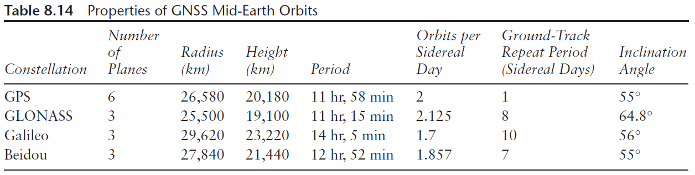

## Introduction

**GPS** (Global Positioning System), also known as **NAVSTAR** (NAVigation Satellite Time And Ranging) had its first satellite launched in 1978.

Below are the 4 constellations of GNSS systems:

* **Global Positioning System (GPS)** \- United States
  * *Standard Positioning Service (SPS)*  
  * *Precise Positioning Service (PPS)*  
* **GLONASS** \- Russia
* **Galileo** \- Europe  
  * *Open service (OS)*  
  * *Public regulated service (PRS)*  
* **Beidou(/Compass)** \- China

Their properties are:

{width=600px}
