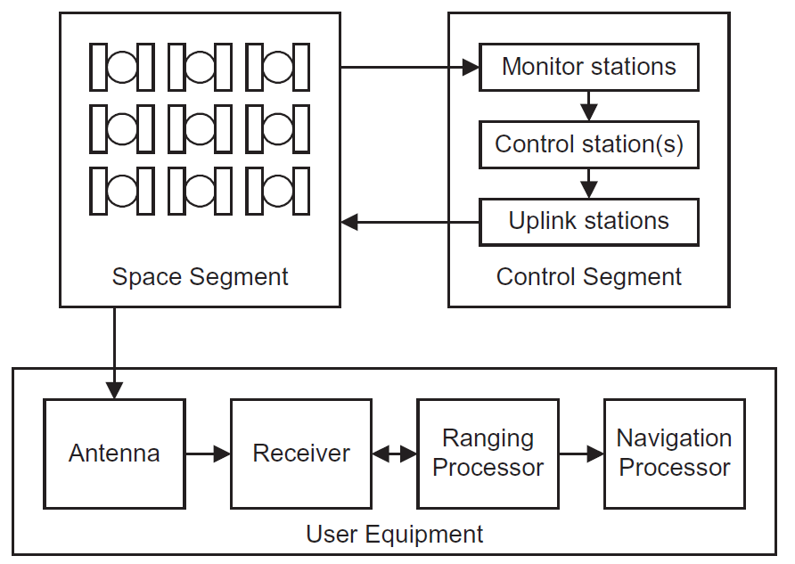

## GPS segments

The GPS system consists of *three segments*:

1. **Space segment** (satellites with atomic clocks)
2. **Control segment** (ground stations for clock offsets)
3. **User segment** (receivers)

{width=400px}

GNSS orbital planes are **inclined** with respect to the equator (at 55° for GPS). All the satellites form a **constellation**.
