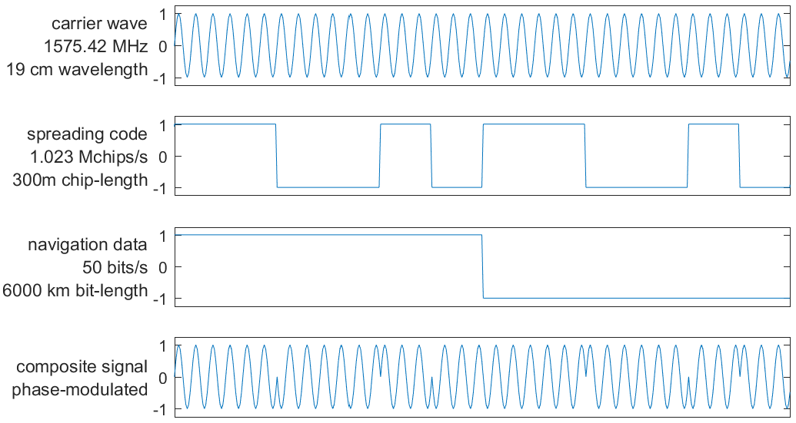

## Radio Signal

### GPS L1 CA-­signal

The GPS radio signal is modulated through **Biphase shift key (BPSK) modulation**, with the amplitude of the signal given by:

$$
s(t) = \sqrt{2P} C(t) D(t) \cos(2\pi f_{\text{ca}} t + \phi_0)
$$

with:

- $P$: the signal power.
- $C(t)$: the **spreading code** (±1). It is also called the **Pseudo Random Noise** (PRN) and is unique to each satellite, publicly available.
- $D(t)$: the **navigation data** (±1). It contains the satellite orbit and clock information.
- $f_{\text{ca}}$: the **carrier frequency**. It is in the L-band between 1 and 2 GHz.
- $t$: time.
- $\phi_0$: phase offset.

{ width="600" }

### Message Format

There are two main formats of **navigation data message**:

- **Fixed frame**: data always transmitted in same order with same repetition intervals
- **Variable frame**: a serie of fixed-length messages may be transmitted in any order
