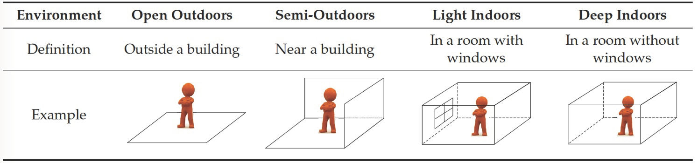

<!--AUTOMATICALLY GENERATED
**********************************************************************
*                                                                    *
*    This file was automatically generated by copying                *
*    'content/notes/privacy/spaces.md'. If you want to manually      *
*    overwrite it, you have to remove this whole comment.            *
*    Otherwise, it will be overwritten the next time any change      *
*    happens in the notes.                                           *
*                                                                    *
**********************************************************************
-->

## Spaces

Perceiving and describing space:

* Empty or containing things
* Unlimited or bounded  
* Physical or imaginary

**Cell**: is a bounded portion of space (a space unit)

Space in Positioning and Localization: partitioning space from the **sensor reception perspective**

Space classification according to reception of GPS signal:

* **Open outdoors**: outside building, open sky condition, enough satellites for positioning
* **Semi-outdoors**: outside building, slight coverage (e.g. wooded area), some satellites availability
* **Light indoors**: inside building, slight coverage (e.g. areas around windows), some satellites availability
* **Deep indoors**: inside building, no satellite coverage

{width=500px}

Spaces are abstracted and represented using:

* Boundary Representation (BRep)  
* Constructive Solid Geometry (CSG)  
* Spatial Occupancy Enumeration

**Navigation network** (supported by Poincaré duality theory):

* **Nodes**: associated with space units, can contain semantic information about location
* **Edges**: represent connectivity between spaces
* **Costs** (of edges): indicate distance or travel time between nodes

Space partition in 3D:

* Bottom enclosure
* Side enclosure
* Top enclosure

| Field | Classification | Physical Boundary  |
| :---- | :---- | :---- |
| **Navigation** | Functional space, Object space, Remaining space & Indoor, Semi-indoor, Semi-outdoor, Outdoor | Architectural (e.g. wall, floor, roof, fence) |
| **Positioning and Localization**  | Indoor, Semi-outdoor, Outdoor | Building, waterbody, bridge, tunnel |
