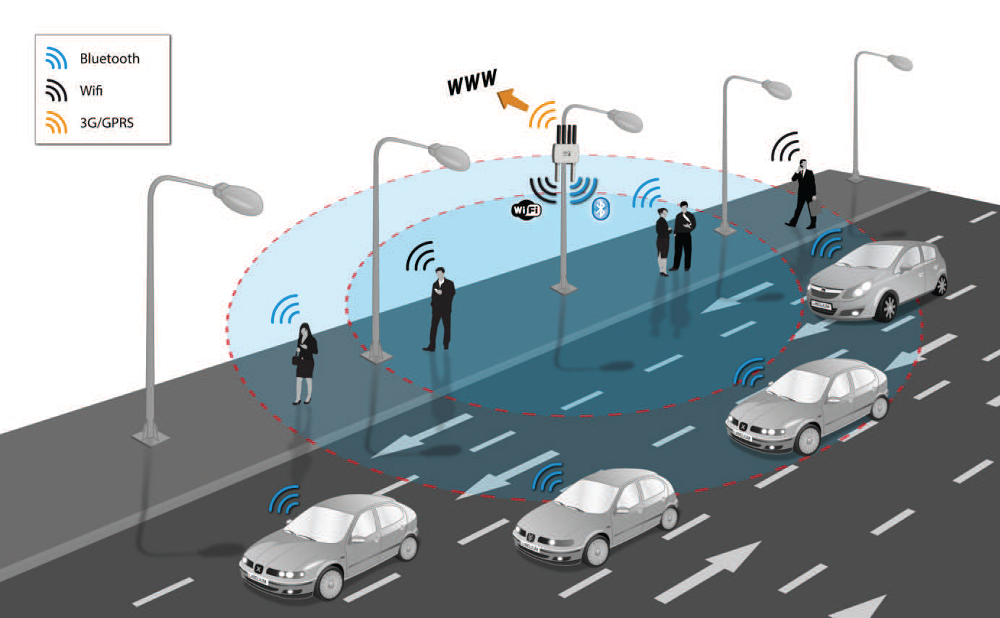

## Hybrid and Other Techniques

### Meshlium

Meshlium is a device that uses WiFi and Bluetooth scanners to detect other devices, which can be used for a range of applications/research (e.g. Vehicle Traffic Detection).

WiFi and Bluetooth radios (of devices) periodically send out messages, containing:

* MAC address of wireless interface
* Strength of the signal (RSSI)
* Vendor of the smartphone
* WiFi Access Point and Bluetooth friendly name
* Class of Device (CoD) (only when Bluetooth)

{width=500px}

**MAC address randomization**: for privacy randomized MAC address, reverts to **"factory" MAC address** when connected to WiFi

**Adaptive Frequency Hopping (AFH)**: algorithm that enables Bluetooth radio to dynamically identify channels already in use and avoid them

### Trilateration

### Inertial Navigation Systems (INS)

### Visual Based Indoor Localisation

### Isovists
